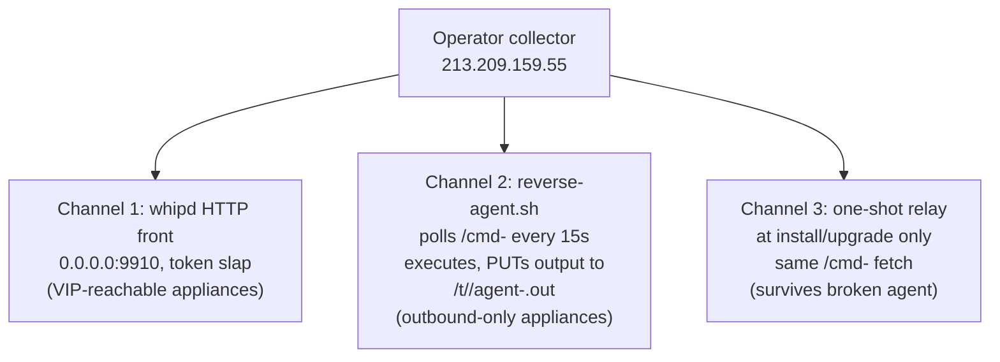

Two days ago this was a story about two samples. Then twenty. Now it is a story about a server, because the server is still running, and watching it work turns out to be the most instructive part of the whole campaign.

`213.209.159.55` sits on FeoPest SRL (AS208137, a Moldova-registered operator with a German POP, the kind of network where abuse reports go to `admin@` at a `.life` domain). Since October 1 it has been the second wave's everything: dropper distribution, stolen-config collector, chisel host, and, as of this week, live command-and-control. While I was writing the previous piece it shipped two new code revisions. This post is what nine months of accumulated evidence and two days of live observation say about the box, the operator, and what defenders should do before it burns.

The earlier pieces are [Pitboss Never Sleeps](/2026/10/03/netscaler-pitboss-log-to-root/) and [Twenty in Eighteen Hours](/2026/10/03/netscaler-second-wave-constant-pivot/). One claim from the second piece gets corrected below, in public, because it turns out I fell for a classic attribution trap.

## Status: Alive, and Debugging in Production

As of late October 3 UTC, both second-wave hosts are up. The Platypus C2 (`entretiensol.com`, 195.123.233.245 on Green Floid) still presents its enrollment-only face to the world. The collector answers on 80 and 443, and on 443 it serves, to anyone who asks, a per-target installer: `GET /t/<token>/` returns the deployment bundle for that token. Nineteen live tokens, six-hex identifiers, `application/x-sh`.

The bundle I pulled on the evening of October 3 was 34,102 bytes and self-labeled `v19` in `/nsconfig/.slap/stage.version`. Thirty-four minutes later the same URL served 34,901 bytes. The operator is not just deploying; he is iterating, live, against whatever the field is doing to him. The diff between those two builds is the subject of the next section, and the changelog visible across all revisions reads like a very honest post-mortem of a deployment campaign that keeps encountering reality:

- gen 2 added a watchdog (`/var/tmp/.slap-watch.pid`) because tunnels died
- gen 3 added a timestamped loot log and a `validate_tgz()` guard because empty and truncated archives were reaching the server
- v19 added HA-pair takeover because appliances kept failing over away from the webshell
- the newest build added a one-shot command relay because, per the code comment, tasking "does not depend on reverse-agent polling and survives a stale reverse-agent process"

Every line of this changelog is a failure the operator observed in the field and engineered around. That is what an active campaign looks like from the inside.

## v19: Forcing the Failover

The headline feature deserves its own name because it changes triage guidance. The kit's new `ha_recover()` function runs on NetScaler high-availability pairs:

```sh
/netscaler/nscli -norc -s -U '%:nsroot:.' 'show ha node'
```

That invocation matters: `-U '%:nsroot:.'` is the appliance CLI's local no-password form, usable as root from the appliance's own shell. The kit has root; root gets the CLI without credentials. It then:

1. Runs `sync HA files all` to push the webshell, boot hooks, and the whole `/nsconfig/.slap` tree to the standby node, and marks completion in `/var/tmp/.slap-ha-sync.done`, logging everything to `/var/tmp/.slap-ha-recovery.log`.
2. If the compromised node is Secondary and cannot push, it runs **`force HA failover`** so the VIP, and the webshell behind it, lands on the node it owns. The code comment is unambiguous about the motive: a cold start can install the receiver on the passive node while the VIP remains on its peer.

For defenders this converts an operational nuisance into an indicator: **an unexplained HA failover on a NetScaler pair during this campaign's window is now a compromise signal, not a stability problem.** And any triage that inspects only the node currently holding the VIP is inspecting the wrong box; the v19 operator explicitly moves the VIP onto the node he controls. Both nodes, every time.

## The Three-Channel C2

The newest revision completes a command architecture that the v19 family had half-built. There are now three ways in, covering both network postures an appliance can have:


<span class="fig-cap">Fig 1: the operator's own comment calls channel 2 an "outbound repair channel" for Gateways behind an external load balancer, where the public VIP never touches the exploited node.</span>

The persistent poller is the interesting one. Every fifteen seconds it fetches `/cmd-<token>` from the collector, trying port 443 then port 80. The response's first line is a command ID, the remainder is shell; dedup lives in `/nsconfig/.slap/reverse.seen`; output and return code go back via PUT to `/t/<token>/agent-<cmdid>.out`. Persistence is triple: root cron every minute, an `rc.netscaler` boot line, and a watchdog relauncher. And there is a neat deployment trick: the heredoc template hardcodes the canonical collector URL and a `sed` rewrites that single line per target, so every victim runs a byte-identical agent that differs in one string.

Detection falls out of the protocol: an appliance making outbound `GET /cmd-[a-f0-9]{6}` requests on a fifteen-second cadence, or PUTting `/t/[a-f0-9]{6}/agent-*.out`, is owned, full stop. When I checked, the `/cmd-` endpoints returned 404 for every token I know: the operator stages a command, the pollers consume it, the endpoint goes quiet again. Transient tasking, which is worth remembering when someone tells you a clean 404 means a clean appliance.

One more capability surfaced through community reports on the address: by October 3, observers had flagged **Ligolo-ng C2 listeners on ports 11601 and 11602** on the same box. Sequential high ports suggests one listener per tunnel, which makes the 116xx range a victim-count dial for anyone with netflow.

## The Collector Is Write-Only, and That Is Good News With an Asterisk

I tried to characterize the exfil side of the server without touching victim data: every read method against a loot path under a token (GET, HEAD, ranged GET, OPTIONS) returns a flat 400. The only thing the box will ever serve is the dropper itself. Uploads land in storage that is never mapped back to a URL, and there is no listing.

Two consequences. First, the reassuring one: victim configs are not lying around exposed on a misconfigured web root for random people to browse; the actor holds them, but they are not public through this host. Second, the asterisk: everything the kit uploads (`/nsconfig` including bind credentials and TLS keys, config history, any system backups found) should be considered delivered to the operator the moment a PUT succeeded. Assume compromise of every secret the appliance held, regardless of what the collector will or will not serve you.

## Nine Months of Rap Sheet

The most useful thing about a stable criminal address is that victims have been meeting it for months, and some of them left records. Two unrelated victim-side artifacts in the corpus reference `213.209.159.55` as the attacking source long before anyone had heard of pitboss:

- **February 7, 2026, 11:24 UTC:** a probe for `/.env` against an Austrian WordPress shop, recorded in the shop's own security-log database, uploaded to the corpus by the victim
- **March 1, 2026, 18:00 UTC:** `GET //.git/HEAD` with user-agent `Go-http-client/1.1` against a Brazilian WordPress site, recorded in its access logs inside a cPanel backup pulled the same day

Both are textbook exposure checks for leaked environment files and git repositories. Community flags on the address push the start further back: "Port Scanning" on **January 25**, and an active vulnerability-scanner classification on **February 9**.

So the biography assembles itself: a Go-based mass web scanner on FeoPest space since at least January, grinding through WordPress estates in Europe and South America; then, within days of the NetScaler zero-days becoming public, the same address shows up doing CVE-2026-88771 exploitation against NetScalers (three independent reports on October 2, plus a private report that reached me: pitboss attempts against a specific appliance around October 2, with an uncertain earlier start), and by October 2 at 15:38 UTC it is generating per-target deployment bundles roughly hourly.

I find the continuity reading persuasive: an operator who has run web-scanning infrastructure for months, fluent in Go (scanner, collector, chisel), watches a zero-day land on September 26, weaponizes the public PoC within three days of its September 29 release, and industrializes within four. The alternative, shared tenancy on a bulletproof range, is possible and unprovable either way from outside. What is provable is that the address deserves a longer look in everyone's telemetry than October alone.

The working-hours pattern across the twenty deployments (active 15:38 to 01:32 and 03:51 to 09:43 UTC, quiet for roughly nine hours after) fits a US-Pacific working day plus evening far better than any European or Asian schedule, which sits comfortably with the kit's idiomatic English and red-team-grade code hygiene. Stated as a hypothesis, not a conclusion.

## A Correction: The Domain That Was Not Old

In the previous piece I wrote that `entretiensol.com` was at least nine months older than the campaign, based on a November 2025 passive-DNS resolution and February 2026 appearances in certificate-transparency dumps. That was wrong, and the error is worth showing because it is a trap others will hit.

Registry data shows the domain was **re-registered on 2026-08-20 at 16:59 UTC** through Namecheap. The Wayback Machine shows its previous life: a parked domain serving redirects from 2011 to 2021, then nothing. The 2025 DNS record and the CT-log matches belong to the domain's previous owner; the actor bought a dropped French-lookalike domain at the standard discount, and my passive-DNS pivot faithfully reported the previous tenant's furniture.

The corrected timeline is tighter and more telling anyway: domain drop-caught August 20, fingerprinting of NetScaler estates observed from August 21, and on September 2 a single provisioning afternoon (the Platypus ingress CA minted at 14:07 UTC, a Let's Encrypt certificate at 14:42, thirty-five minutes later), with first observed exploitation the next day. Two lessons: drop-catch domains inherit their predecessors' telemetry, and any age-based attribution claim needs the registry event, not just DNS history.

## What Defenders Should Actually Do

If you run NetScalers and have not yet closed this out:

```sh
grep -i "pitboss\|NSPPE" /var/log/ns.log*          # poison lines (attempt or success)
ls -l /bin/sh                                      # mode 6555 = owned
ls /nsconfig/.slap/ /var/tmp/.nsmon/ 2>/dev/null   # stage.version, reverse-agent.sh
ls /var/tmp/.relay-stage.log /var/tmp/.slap-ha-recovery.log 2>/dev/null
grep -i "php_flag\|AliasMatch\|AddHandler" /etc/httpd.conf
```

On the network side, block and hunt `213.209.159.55` (dropper, collector, Ligolo on 116xx) and `195.123.233.245` (C2), and search egress for the shapes above: `/cmd-` GETs on a 15-second cadence, PUTs to `/t/<hex>/agent-*.out`, anything toward the 11601+ range. On HA pairs: check both nodes and review every failover event since September 26. Hunt at least thirty days of logs; the attempts began before the patches existed.

Reports with full evidence are with both networks' abuse desks, and the technical picture is with the teams tracking the parent campaign. The box is still up as I publish this; if history rhymes, the primary actor's discipline about burning infrastructure is not shared by his imitator, and this one will stay plugged in until someone unplugs it.

## Appendix: New IOCs From This Phase

**Host artifacts (v19 and newer):** `/nsconfig/.slap/stage.version` (contains `v19` or higher), `/nsconfig/.slap/reverse-agent.sh` and `reverse-agent.template`, `/nsconfig/.slap/reverse.seen`, `/var/tmp/.slap-watch.pid`, `/var/tmp/.s2loot.log`, `/var/tmp/.slap-ha-recovery.log`, `/var/tmp/.slap-ha-sync.done`, `/var/tmp/.relay-stage.log`; cron `* * * * * /bin/sh /nsconfig/.slap/reverse-agent.sh`; the `ha_recover()` invocation pattern `nscli -U '%:nsroot:.'` in process trees.

**Network:** `GET /cmd-[a-f0-9]{6}` to 213.209.159.55 (either port), 15s cadence; `PUT /t/[a-f0-9]{6}/agent-*.out`; Ligolo-ng listeners observed on 213.209.159.55:11601 and :11602; historical scanning from the address since 2026-01-25 (`Go-http-client/1.1`, `/.env` and `//.git/HEAD` probes).

**Samples:** live-served bundle 2026-10-03 21:14 UTC sha256 `0bc2f516841bb9921a37d841231526a0662b42033b02974562a51cc229a61051` (34,901 B, relay build); v19 34,102 B sha256 `19bbd33e20fc18715d4075575a1673ee2ed350755bdb75bffa8dd532a013d7e4`; chisel-freebsd-amd64 `84f23d964ab636c81d95c3185f06a2ec628a9762dc767131d775500caf8dda0a`.

**Infrastructure:** 213.209.159.55 (FeoPest SRL, AS208137, netname FeoPrestSRL); 195.123.233.245 (Green Floid LLC, AS204957, PTR vds1751198.hosted-by-itldc.com); entretiensol.com re-registered 2026-08-20 16:59 UTC (Namecheap), Let's Encrypt cert notBefore 2026-09-02 14:42 UTC, live self-signed leaf CN=platypus-ingress issued 2026-09-28 22:00:35 UTC.

Corrections welcome, and this phase more than most: half of this piece was written by an operator who keeps fixing his own bugs in public. The counts here are floors, not censuses.
