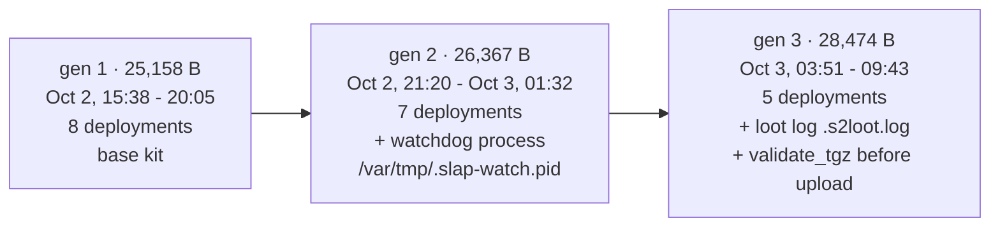

Yesterday's teardown of the NetScaler pitboss campaign ended on a curiosity: two 25KB bundles, first submitted October 2, that rebuild GTIG's WHIPSHOT and SLAPSHOT tunnelers from the published descriptions and brand themselves a "lab PoC". I called them a copycat kit and left it there.

That ending bothered me overnight. The bundles carried something most malware families do not: constants. A cookie gate reused across deployments. An exfil host and per-target path tokens. One-shot enrollment tokens from a Platypus server. A template placeholder hash. A callback secret. A default callback address. Constants are search keys, and search keys are how you find out whether you are looking at an artifact or an operation.

So I spent today pivoting the corpus on every distinctive string the reverse engineering produced, cross-referencing the file relations of every campaign IP and domain, and diffing whatever came back. The answer is an operation. Twenty deployments in eighteen hours, code changing between them, an operator visibly debugging field failures, and a victim artifact that tells its own quiet story. This post is the investigation; the base campaign analysis is in [Pitboss Never Sleeps](/2026/10/03/netscaler-pitboss-log-to-root/).

## The Pivot Toolkit

The method is simple to state. Take every constant that survived the reverse engineering:

```
ay#39&RGYvv4Xuzy                  sec_monitor superuser password
QI@UEG5PC7oRt31E                  .local_journal webshell password
e4d909c290d0fb1ca068ffaddf22cbd0  template placeholder hash
072874c28950cf7befd319d17e9709e7  analog-kit cookie gate
e826d7ddf3c85920                  .ctxs.receiver cookie gate
y7lg7jq57b / NSMON_CB             nsmon secret and callback variable
plt_wqmnjp5jusrcpzicqa2t...       Platypus one-shot enrollment token
loot_nsconfig.tgz                 exfil upload names
entretiensol                      C2 domain
```

Search the corpus for each as a content term, then pull the file relations (what communicated with what, what was downloaded from where) for every IP and domain in the IOC set, and passive DNS for the domain. Diff the results against the already-known hashes so only new material surfaces. Everything that matched was downloaded and verified against its hash before analysis; nothing was executed.

The traps are the interesting part, and I hit two of them early enough to matter. Both are in a section of their own at the end, because each one would have produced a confident, wrong finding.

## Finding One: The Copycat Kit Is a Deployment Campaign

The two bundles from yesterday are the first two of twenty. Between October 2 at 15:38 UTC and October 3 at 09:43 UTC, twenty distinct bundles landed on VT, all byte-related but none identical, every one carrying the same cookie gate (`072874c28950cf7befd319d17e9709e7`) and the same exfil endpoint (`http://213.209.159.55:443/t/<token>`), each with its own six-hex-character path token: `906b4f`, `818f74`, `a779ab`, `324d58`, `380d56`, `ae7427`, `29a04f`, `1f0a10`, then `9c3166`, `3b6d2f`, `471d83`, `274124`, `db6c6c`, `bad2ad`, then `861cd3`, `62cd78`, `6f3c3e`, `a718e4`, and two I will get to separately.

Twenty submissions in eighteen hours is roughly one per hour. Per-target tokens mean per-target generation, not one file flung around. And whether every submission is a distinct victim or a mix of victims and the operator's own testing cannot be proven from submission metadata alone; what can be proven is the cadence and the code, and the code is talking.

### Three Generations, One Changelog

The bundles sort cleanly by size into three code generations, and the diffs between them read like release notes written by someone watching real deployments fail:


<span class="fig-cap">Fig 1: three generations in eighteen hours. Each jump is a fix, and each fix implies a failure observed in the field.</span>

Generation two adds a watchdog: a pid file at `/var/tmp/.slap-watch.pid` and supervision logic keeping the tunnel stack alive, plus a reworked comment explaining that the setuid shell is what keeps the webshell root "even when Apache drops privileges". That is a fix for deployments where the tunnel died or the shell lost euid.

Generation three is the most revealing. It adds `/var/tmp/.s2loot.log`, a timestamped log of every exfil action, and a `validate_tgz()` function that runs `tar tzf` on each archive and refuses to upload anything that does not list cleanly. You do not write archive validation for fun; you write it because your server received truncated or empty tars from real appliances and you were blind to it until you added the log. The operator is not just deploying, they are instrumenting their own loot pipeline, mid-campaign, between deployments.

Two more details from the token ledger. The token `818f74` appears twice: first in a generation-one bundle at 15:59 on October 2, then again in a generation-two bundle at 01:00 on October 3. The same target identifier, re-deployed with newer code, five hours apart; at least one target got the upgrade treatment. And the earliest generation-three bundle (03:51) does not carry a fixed exfil path at all: its `EX` variable is assembled at runtime, which removes the one constant that all previous generations leaked into every log line. Someone read the same IOC lists the rest of us did.

## Finding Two: The Exfil Host Also Serves Chisel

Among the files downloaded from `213.209.159.55` during sandbox runs sits a 10.8MB FreeBSD binary named `runtime-freebsd.bin`, internally identified as `chisel-freebsd-amd64` (sha256 `84f23d964ab636c81d95c3185f06a2ec628a9762dc767131d775500caf8dda0a`, go1.26.8, detected as `hacktool.chisel/httptunnel`).

So the second wave's tunneling story is now complete and embarrassingly pragmatic: the bespoke "SLAPSHOT-analog" agent exists, and next to it the operator serves plain chisel, the standard HTTP-tunnel tool, built for the appliance's FreeBSD, from the same box that receives the loot. When the cloned tool has a bad afternoon, the off-the-shelf one is one `fetch` away. Detection for this host should not assume the loot endpoint is the only thing it serves.

## Finding Three: The Platypus Enrollment Ledger

The primary actor's C2 used one-shot enrollment tokens, which makes them a ledger. The pivot recovered four full bootstraps and two one-line installers, each with a distinct token, all pinning the identical certificate pair (ingress CA minted September 2, project CA `b51a65e0-...` minted September 28). One server, six enrollments, and a clean two-day targeting window:

| When (UTC, 2026) | Artifact | Token (prefix) | Binary identity |
|---|---|---|---|
| Sep 28, 18:19 | one-line installer | `dl_d3gifor...` | agent fetched live |
| Sep 28, 19:28 | full bootstrap | `plt_wqmnjp5j...` | `ns_827664.pl` |
| Sep 28, 20:22 | full bootstrap | `plt_wsemghw6...` | `ns_827664.pl` |
| Sep 28, 23:48 | full bootstrap | `plt_2uhfcg6a...` | `.ns_09343.pl` |
| Sep 29, 04:05 | one-line installer | `dl_3wrbowpyp...` | agent fetched live |
| Sep 29, 15:03 | full bootstrap | `plt_znwetalq...` | `.ns_09343.pl` |

Note the binary identities: two enrollments run `ns_827664.pl`, two run a dot-prefixed `.ns_09343.pl`, the hidden-file variant, which matches the two FreeBSD agent builds already in the corpus. The naming evolved mid-campaign toward less visible filenames, the same direction as everything else this actor ships.

## Finding Four: A Silent Implant on a Real Appliance

The smallest hit of the sweep is the one I keep thinking about: a 47-byte text file submitted September 28, named `/private/var/tmp/.nsmon/.cfg`. That is a real appliance's nsmon implant config, and it reads:

```
NSMON_CB=udp://192.168.100.2:4444
NSMON_PORT=0
```

`192.168.100.2:4444` is not the actor's callback; it is nsmon.pl's hardcoded default, an RFC1918 address from the author's lab that cannot route anywhere on a victim network. No secret line. In this deployment the dropper's environment variables never reached the implant, the implant wrote its config from defaults, and the bind shell sat there for the rest of its life phoning an address that does not exist. A root shell on a compromised appliance, deaf and mute.

For responders this file is a gift: `.nsmon/.cfg` tells you immediately which deployment style you have (a configured callback means the dropper ran clean; the default means env-passing failed), and the port pin (`NSMON_PORT=0` versus a number) tells you whether the shell moved off the 41000-41999 hunt range.

## Finding Five: Infrastructure Has a Past and a Present

Passive DNS gives `entretiensol.com` three resolutions: `213.186.33.5` in November 2025, then `162.255.119.22` and `195.123.233.245` on August 24, 2026. The C2 domain is at least nine months older than the campaign, and its August move happened three days after Unit 42's earliest fingerprinting and nine days before the first Platypus enrollment. Aged domain, repurposed, infrastructure choreography lining up with the operational timeline.

The staging hosts are decaying in real time: the `update_c08937.pl` path on `64.94.85.67` now returns 404; `/lula` on `31.56.197.72` answers with a JSON-RPC error body, which tells you the box fronts an API service rather than a plain file server; and both `213.209.159.55` and `130.94.20.222` answer arbitrary paths with a bare `ok`. Those `ok` responses are already being captured and submitted by other hunters, so the window for sinkholing or monitoring these boxes with clean telemetry is closing.

## The Traps: Two Confident Wrong Answers I Almost Shipped

Pivoting on constants works, and the failure modes are worth as much as the findings.

**Trap one: the placeholder that impersonates a lineage.** Searching the template placeholder `e4d909c290d0fb1ca068ffaddf22cbd0` returned twenty hits, and they looked beautiful: game-mod RAR archives and minified JavaScript bundles, all "containing the kit's template hash". Tooling lineage, ecosystem, maybe attribution. Then I opened one of the JS files. The string sits in a documentation comment: it is `md5('The quick brown fox jumps over the lazy dog.')`, the canonical MD5 test vector, present in every JavaScript MD5 library ever written and in every asset bundle that packs one. The kit's author reached for the most famous hex string in computing as a placeholder, and my pivot dutifully found every copy of it on earth. Verify a content hit by opening the matching context before calling it attribution.

**Trap two: ancient files, current URLs.** The IP and domain relations returned files with first-seen dates in 2006, 2012, 2017: a 2-byte `ok`, stock nginx 404 and 403 pages, an 18-byte "404 page not found". It looked like the campaign hosts had a decade of malware history. They do not. Tiny response bodies are content-addressed: a bare `ok` is one hash forever, first seen whenever anyone ever submitted a 2-byte `ok`, and its URL associations update whenever anyone fetches it from a new server. The file's age is meaningless; the association is current. Those old dates are other people probing the campaign infrastructure this week, recorded through ancient hashes.

One genuine design note falls out of trap one, though. In the raw template, that 32-hex placeholder sits in a SHA-256 comparison slot, where it can never equal any password digest. The shipped panel is locked by construction, inert until the deployment stage substitutes the real digest. A placeholder that doubles as a null-state is either very deliberate or very lucky, and after three code generations of visible intent, I know which way I would bet.

## Detection Additions From the Sweep

On top of the hunts in the base article, the second wave adds:

```sh
ls -la /var/tmp/.slap-watch.pid /var/tmp/.s2loot.log 2>/dev/null   # gen 2/3 artifacts
cat /var/tmp/.nsmon/.cfg 2>/dev/null                              # deployment style + callback
# network: any flow to 213.209.159.55 (loot + chisel), 195.123.233.245, 162.255.119.22
# egress: chisel client signatures from an appliance are never legitimate
```

And the exfil token list doubles as a blocklist if you retain HTTP egress logs: `/t/` followed by six hex characters on port 443 to a raw IP, with a PUT or a `curl -T` upload pattern, is this campaign's signature shape.

## Why Constants Beat Hashes

Hashes die in one AV submission. Everything durable in this investigation came from constants: a cookie gate reused twenty times, a default callback baked into the source, CA mint dates, token grammar, upload filenames. The moment yesterday's article went up, the operator's rational move was to rotate every hash-bearing artifact, and generation three already shows the instinct (runtime-built exfil path). But you cannot rotate what the code needs to function: the cookie has to match the operator's memory, the panel has to compare against something, the implant has to know where to phone. Hunt the semantics, not the bytes.

Full second-wave sample table with hashes is in the base article's addendum appendix; the new network IOCs from this sweep are `213.209.159.55` (loot and chisel), `195.123.233.245` and `162.255.119.22` (historical C2 resolutions, August 24), `213.186.33.5` (November 2025), the eighteen exfil path tokens, and the four additional Platypus enrollment tokens.

Corrections welcome. If you are hunting this wave: the gen 3 bundles were still landing when this went up, so treat the counts here as a floor, not a census.
