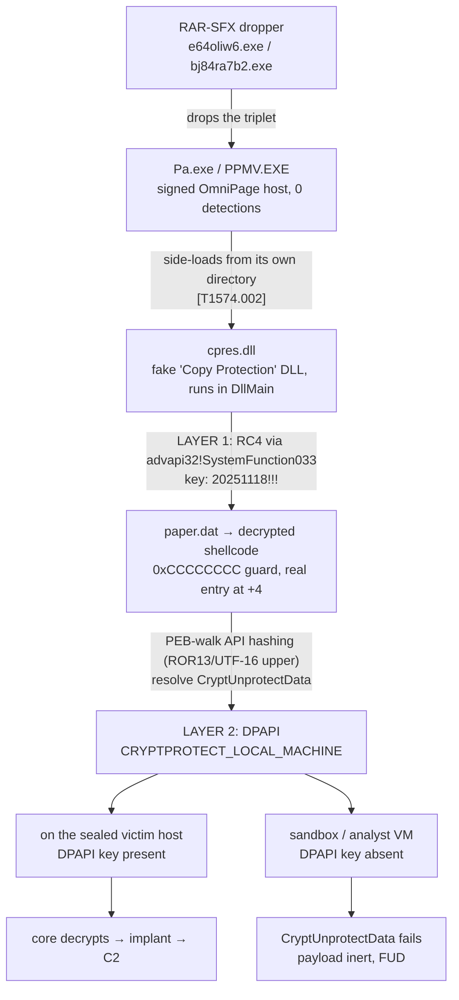
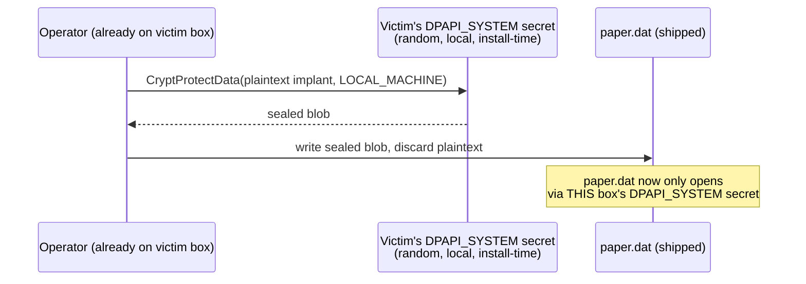

Another one off X. [@smica83](https://x.com/smica83) posted a sideloading triplet seen from Malaysia. A signed Nuance OmniPage executable, a malicious `cpres.dll`, and an encrypted `paper.dat`, tagged PlugX, mostly undetected. The shape is familiar enough to be worth an afternoon. The afternoon got away from me, the way these do, and what came out the other end wasn't quite PlugX and didn't give up its C2. I still think it's worth writing down, because *why* it won't give up its C2 is the interesting part.

Let me say up front where this lands. VirusTotal labels the loader `korplug`/PlugX. I don't think that's right. Or rather, it's the lazy label you get because PlugX and ShadowPad share the same sideloading triad and the engines can't tell them apart. The tradecraft here, host-locking the payload and the obfuscated stub, reads a lot more like **ShadowPad / POISONPLUG.SHADOW** than classic PlugX. I'll show my work on that, including the part where my first read (and the file's own VT label) was wrong, and the spot where my emulator lied to me for three sessions before I caught it.

Here's the whole chain on one screen:


<span class="fig-cap">The fork at the bottom is the whole story: identical bytes, two different outcomes, decided entirely by which machine runs them.</span>

### The triplet

Nothing exotic here. A signed host, a malicious DLL it loads from its own folder, an encrypted blob the DLL decrypts and runs:

| Role | File | Notes |
|------|------|-------|
| Signed host | `Pa.exe` / `PPMV.EXE` | Legit **Nuance/ScanSoft OmniPage**. Valid, 0 detections. |
| Loader | `cpres.dll` | Malicious. Impersonates OmniPage's "Copy Protection" module. Internal name `3650652.dll`. |
| Payload | `paper.dat` | 542,996 bytes, entropy 8.00. |

The lure is decent. OmniPage really does ship a `cpres.dll` ("Copy Protection"), historically signed, so the swap doesn't look out of place next to the real executable. The malicious code runs at load time. `cpres.dll` only exports Delphi/RTL stubs, so the host never calls into anything malicious by name; the work happens in DllMain/unit-init. Droppers were RAR-SFX stubs landing at `C:\windows\<random>.exe`.

### Layer 1: RC4 hiding behind a Windows API

`paper.dat` is flat 8.0 entropy, so single-byte XOR was never on the table. The loader decodes its own import names on the stack (one byte XOR'd with its index, the same trick it uses for everything), loads `advapi32`, and calls the function people forget can decrypt anything you hand it:

```text
SystemFunction033(pData, pKey)            ; advapi32, undocumented RC4
  pData = { 0x84914, <paper.dat buffer> }
  pKey  = { 0x0b,    "20251118!!!" }
```

`SystemFunction033` is RC4. That's the whole cipher. The key is the 11-byte string `20251118!!!`. And yes, that's a date, `2025-11-18`, which is a nice campaign pivot to hold onto. Calling a Windows API instead of carrying your own RC4 keeps the loader clean of any constant a scanner would recognise. Living off the land, crypto edition.

Once you have the key it falls out offline:

```python
def rc4(key, data):
    S = list(range(256)); j = 0
    for i in range(256):
        j = (j + S[i] + key[i % len(key)]) & 0xff
        S[i], S[j] = S[j], S[i]
    out = bytearray(); i = j = 0
    for b in data:
        i = (i + 1) & 0xff; j = (j + S[i]) & 0xff
        S[i], S[j] = S[j], S[i]
        out.append(b ^ S[(S[i] + S[j]) & 0xff])
    return bytes(out)

dec = rc4(b"20251118!!!", open("paper.dat", "rb").read())
# dec[:4] == b"\xcc\xcc\xcc\xcc"  (guard dword; the real shellcode starts at +4)
```

Now the part I have to be honest about, because I wasted real time on it. *Reaching* that `SystemFunction033` call inside an emulator was the actual fight. I run this stuff under Qiling, and for three sessions I was convinced `cpres.dll` had a deliberate anti-emulation trick: execution would dive into a still-encrypted buffer, hit a `BOUND` instruction, and throw, and there was all this SEH machinery around it that looked intentional. I wrote up notes about a "SEH/BOUND decrypt gate." It was nonsense. The cause was a bug in *my* harness: a redundant `LoadLibraryA` hook firing alongside Qiling's built-in, doing a second `stdcall` return and popping stale stack into EIP, which threw control into the encrypted bytes. The "SEH machinery" was just GCC's normal C++ exception runtime. Delete the duplicate hook and the flow goes straight and boring: `LoadLibraryA("advapi32") → GetProcAddress("SystemFunction033") → RC4 → jump`. A lesson I keep relearning: your tooling will invent tradecraft that isn't there, and it's very flattering to believe it. Verify before you attribute.

### The shellcode stub

The decrypted `paper.dat` is a small obfuscated stub (~600 bytes) followed by a big encrypted core. The stub does not want to be read. In 599 bytes I counted 56 conditional jumps and 31 do-nothing instructions (`sub esi,0`, `or cx,0`, `add eax,0`), plus the usual `push reg … pop reg` junk wrappers and opaque-predicate pairs (two opposite jumps to the same target, e.g. `jb` then `jnp` to the same label). When I let it run, the stub spent roughly **400,000 instructions** doing a PEB walk that should take a few hundred. That kind of blow-up isn't hand-written junk; it's an obfuscating compiler. Stylistically it's **ScatterBrain**, the obfuscator Mandiant tied to ShadowPad/APT41.

API resolution is hash-based, and it's a slightly unusual hash:

```text
h = 0
for each wide char c of UPPERCASE(module_name):   ; UTF-16, uppercased
    h = ROR32(h, 13) + c
```

Classic ROR13, but computed over the wide-character, uppercased module name. `KERNEL32.DLL` hashes to `0x6a4abc5b`, `NTDLL.DLL` to `0x3cfa685d`. Once it has `GetProcAddress` by hash, everything after that is resolved by plain name.

### Layer 2: the wall

The stub loads `crypt32.dll`, resolves `CryptUnprotectData`, and calls it on the encrypted core carved out of the decrypted `paper.dat`. I caught the blob it hands over and parsed it:

```text
provider GUID    df9d8cd0-1501-11d1-8c7a-00c04fc297eb   (standard DPAPI)
masterkey GUID   0fcb9e6f-88d6-42e2-aaee-b1f718bdd88e
flags            0x4  =  CRYPTPROTECT_LOCAL_MACHINE
cipher / hash    AES-256 / SHA-512
ciphertext       0x83360 bytes
```

That one flag is the entire story. This is a genuine **DPAPI** blob, and it's machine-scoped.

<aside class="callout">
<span class="lead">Concept — DPAPI, and why "machine-scoped" beats any password</span>
Windows Data Protection API exists so ordinary programs (browsers saving passwords, Wi-Fi saving PSKs) can encrypt data without writing their own crypto. Ask DPAPI to protect something, and it derives the key from a secret that's already local to the machine or the user — you never handle a key at all. Requested with <code>CRYPTPROTECT_LOCAL_MACHINE</code>, that secret is the box's own <code>DPAPI_SYSTEM</code> value: random, generated once at install, stored in the SECURITY hive, never transmitted anywhere. There is no password to guess and no key to steal remotely, because the "key" never left the machine it was born on. Anything sealed this way is, for all practical purposes, addressed to one specific computer and unreadable everywhere else.
</aside>

A `LOCAL_MACHINE` blob is encrypted with the host's `DPAPI_SYSTEM` secret. That secret is random, minted when Windows is installed, and it lives in the SECURITY registry hive. It is **not** a password. There is nothing to brute-force, no wordlist that helps, no GPU that cares. It only decrypts on the exact machine that sealed it (or offline, if you have that machine's SECURITY and SYSTEM hives). Drop `paper.dat` into any sandbox or analyst VM and `CryptUnprotectData` just returns failure. The implant, and its C2 with it, is out of reach of everybody except the intended victim.

So how did the key get onto the victim? It didn't, and that's the elegant bit. Every Windows box already has a `DPAPI_SYSTEM` secret. The operator, already running on the target, called `CryptProtectData(core, LOCAL_MACHINE)` to seal the plaintext implant with the *victim's own* machine key, threw the plaintext away, and shipped the sealed result as `paper.dat`. Nobody plants a key. The victim's pre-existing OS secret does the locking for them. And because the `paper.dat` in the dropper is already sealed, the sealing happened before delivery, against one specific host. This is a pre-targeted, host-fenced payload. It explains the VirusTotal picture perfectly: the whole campaign is FUD and has never been caught beaconing, because no sandbox is ever *that* machine.


<span class="fig-cap">Fig — the operator seals the payload with a key that was already sitting on the victim's disk before the intrusion even started. Nothing new is planted; the victim's own OS does the locking.</span>

It's environmental keying taken to the end of its logic. Not "look around, and bail if it smells like analysis," but "be mathematically dead everywhere except the target."

### So is it PlugX or ShadowPad?

The honest answer is that I can't fingerprint the implant directly, since it's behind the wall, so this is inference, not proof. But the inference leans one way:

| Signal | Classic PlugX | ShadowPad | This sample |
|--------|---------------|-----------|-------------|
| Host-locked payload | never | **yes** (Secureworks: volume-serial keyed) | **yes** (DPAPI variant) |
| Compiler-level obfuscation | no | yes (ScatterBrain, APT41) | yes, consistent |
| Triad + RC4 `.dat` | yes | yes | yes, tells you nothing |

Host-locking is the discriminator. Classic PlugX doesn't bind its payload to the box; ShadowPad does. The documented ShadowPad method uses the volume serial number; this one uses DPAPI instead, which is a different primitive for the same idea. Pair that with ScatterBrain-style obfuscation and I'd put my money on **ShadowPad / POISONPLUG.SHADOW (APT41)**.

Two caveats I want on the record, because attribution is where everyone gets lazy:

1. The things that would *prove* ShadowPad, the full ScatterBrain control-flow flattening and the plugin/config architecture, are inside the locked core. I never see them.
2. DPAPI-`.dat` host-locking is not unique to ShadowPad. Kaspersky documented **Evasive Panda / MgBot** doing almost exactly this: `CryptUnprotectData` over a `.dat` (`perf.dat`), decryptable only on the host by design, file deleted afterward. That's a *different* China-nexus actor.

So rather than slap one flag on it, the fair description is convergence: the triad and RC4 (PlugX/ShadowPad), the obfuscator (ShadowPad/ScatterBrain), and the DPAPI host-lock (Evasive Panda style). The blend is the finding.

### Hunting it

The RC4 key sits in `cpres.dll` at file offset `0xfa34c`, but not in clear text. It's XOR'd `byte ^ (0x36 + i)`, the same index scheme used for the API strings, parked next to an encoded `ADVAPI`. Each build uses a different `<YYYYMMDD>!!!` date-key, so chasing the literal string is pointless. The *encoding shape* is what travels: eight position-constrained "digit" bytes followed by the fixed encoded `!!!`, which always comes out as `1f 1e 61`.

```yara
import "pe"
rule ShadowPad_OmniPage_cpres_loader
{
    meta:
        description = "OmniPage-sideload loader (cpres.dll/paper.dat): RC4-via-SystemFunction033, XOR(0x36+i)-encoded <date>!!! key, DPAPI host-locked stage-2"
    strings:
        $datekey = { (00|01|02|03|04|05|06|07|0e|0f) (00|01|02|03|04|05|06|07|0e|0f)
                     (00|01|08|09|0a|0b|0c|0d|0e|0f) (00|01|08|09|0a|0b|0c|0d|0e|0f)
                     (02|03|08|09|0a|0b|0c|0d|0e|0f) (02|03|08|09|0a|0b|0c|0d|0e|0f)
                     (04|05|08|09|0a|0b|0c|0d|0e|0f) (04|05|08|09|0a|0b|0c|0d|0e|0f)
                     1f 1e 61 }
        $paper = "\\paper." ascii
        $dat   = "dat" ascii fullword
    condition:
        uint16(0) == 0x5A4D and filesize > 200KB and filesize < 4MB and
        ( pe.imphash() == "6f4caacfae18415bdbdbc3bb40e7c016"
          or ($datekey and pe.characteristics & pe.DLL)
          or ($datekey and $paper and $dat) )
}
```

I ran this as a RetroHunt over the last year of VirusTotal and it came back empty beyond the two builds I already had. That's not a failure, it's a result. The whole cluster is two loader builds, two RAR droppers, and one shared, host-locked `paper.dat`. This is a small, targeted thing, not something being sprayed.

For defenders, behaviour beats any static IOC here. The tell is the sequence: a sideloaded DLL resolving `SystemFunction033`, then `crypt32!CryptUnprotectData` over a file-backed buffer, from a process that has no business touching browser credentials. DPAPI calls outside a browser context are the thing to alert on.

### If you actually want the C2

You need the box. Because the core is `LOCAL_MACHINE`-sealed, the config and C2 are only recoverable from the originating host: grab its `SECURITY` and `SYSTEM` hives, pull `DPAPI_SYSTEM` with `impacket-secretsdump`, decrypt masterkey `0fcb9e6f-…`, then `CryptUnprotectData`. No cracking, just key possession. From the file on its own, it cannot be done. For this family, the sample isn't the artifact. The host is.

### IOCs

```text
cpres.dll (loader)     6cc780637a378370ef597844d0b59ab396100eb54131b58432f3e79a7b171741
cpres.dll (MY seed)    25bac861b68882cd7cccc0c20eff42d6ccd3526425f812dd9c4fd5b8fd99f7b3
paper.dat              dadf9f8a35c4a22898e2776c38fe224632e6b692fe26b436aed152e3ce88c04b
dropper e64oliw6.exe   b30209019f515889b9e3dcea2cd4bbb4f76adad6abde7d44f2ca6ddb3e362b52
dropper bj84ra7b2.exe  c798d68dab2573ee9dbfd6fd433bc3556898d3e14c1471fcde936a67e000c67b

imphash                6f4caacfae18415bdbdbc3bb40e7c016
RC4 key                "20251118!!!"  (stored XOR ^(0x36+i) at cpres.dll:0xfa34c)
DPAPI masterkey GUID   0fcb9e6f-88d6-42e2-aaee-b1f718bdd88e
module hashes          KERNEL32 0x6a4abc5b, NTDLL 0x3cfa685d  (ROR13-add, UTF-16 upper)
loader internal name   3650652.dll
drop pattern           C:\windows\<6-8 lowercase alnum>.exe
```

### Why bother writing up a dead end

Because the dead end is the headline. This is a clean field example of an actor making its payload un-analysable away from the victim by borrowing the victim's own DPAPI key, and everything up to that wall is reproducible: the RC4 layer, the key, the hash algorithm, the blob structure, a key-agnostic YARA rule. "0/76, never detonates" doesn't mean harmless. Here it means the payload is locked to a door I'm not standing at.

*Enrichment throughout was passive: VirusTotal and OSINT only, no contact with any live infrastructure.*
