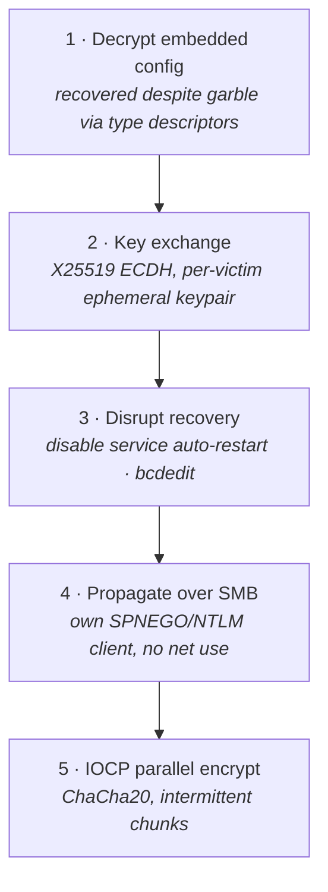
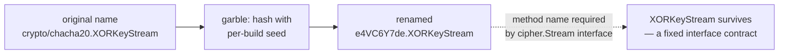
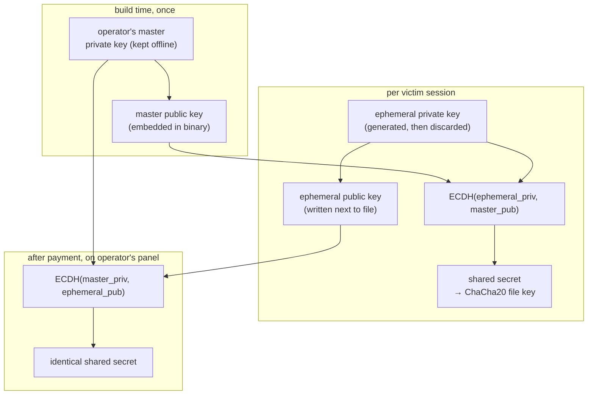
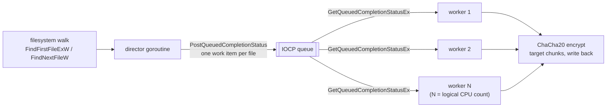
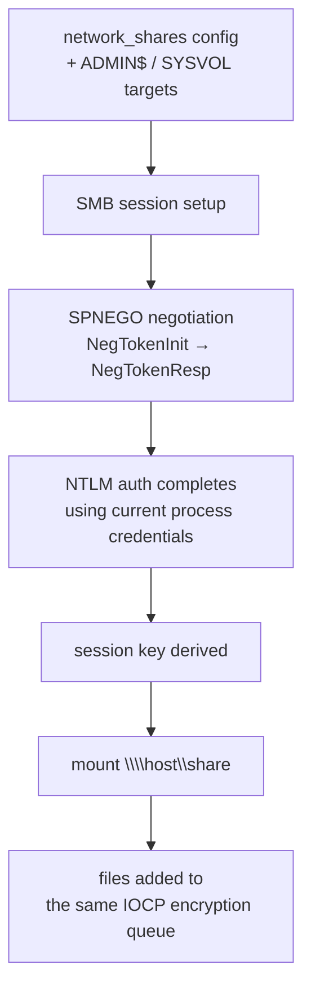

RansomHub emerged in February 2024 and, within a year, became the most prolific ransomware-as-a-service operation by victim count — surpassing LockBit, ALPHV, and everyone else. By the time this sample was submitted to VirusTotal in September 2025, the group had claimed over 500 victims across healthcare, government, critical infrastructure, and manufacturing. When ALPHV collapsed in early 2024 and LockBit was disrupted by law enforcement, their most productive affiliates didn't retire — they moved to RansomHub. That talent migration shows in the code.

The sample I analysed is the Windows x64 encryptor, written in Go and obfuscated with garble. I want to go through what garble actually does to a binary, how to recover the config schema despite it, how the encryption is structured, and how the built-in SMB propagation engine works — because that last part is genuinely unusual. Most ransomware calls `net use` or relies on the deployment toolchain for lateral movement. RansomHub brought its own.

## The Encryptor at a Glance

Strip away the Go internals and garble noise, and the binary does five things in order: decrypt its own config, agree on a key with the operator, propagate itself across the network over SMB, encrypt in parallel, and disable the services that would otherwise let a victim recover without paying.


<span class="fig-cap">Fig 1 — RansomHub carries its own network client and its own encryption engine; it doesn't lean on the deployment toolchain for either.</span>

---

## The Binary

```
File      ransomhub.exe (observed filename varies per campaign)
SHA-256   4106e8c30629eeaf7cbc048066d9ce9f47d84ffe06b33dfc10953a475e82418f
Size      10.62 MB (11,133,952 bytes)
Type      Win32 PE64 EXE (console subsystem)
Language  Go 1.18+ (pclntab magic 0xFFFFFFF0)
Obfusc.   garble (confirmed: SUSP_OBFUSC_Go_Garbled_Apr22_1 YARA match)
First seen 2025-09-18
Detection  53/77 AV engines
```

Section layout:

```
Section   VA         VSize      RawSize    Entropy
.text     0x1000     7,366,917  7,367,168  6.13   ← code + pclntab
.rdata    0x708000   3,509,720  3,509,760  5.53   ← type descriptors, string table
.data     0xa61000     528,688    152,064  5.28   ← BSS + writeable data
.idata    0xae3000       1,168      1,536  3.61   ← static imports (1 DLL)
.reloc    0xae4000     101,176    101,376  5.45
.symtab   0xafd000           4        512  0.02   ← stub only, no symbols
```

The 10.62 MB size is Go's calling card: the runtime, garbage collector, and all imported packages link statically into every binary. The `.symtab` section header exists but contains four bytes of data — Go's toolchain included the section stub but stripped the content. `nm` confirms this: `no symbols`. What's left for analysis is the pclntab embedded in `.text` (for function boundaries) and the type descriptor table in `.rdata` (for struct field names and interface method names).

**Static imports** — the entire import table is one DLL:

```
kernel32.dll  (40 APIs)
```

Go programs on Windows don't use `LoadLibrary` the way C programs do — they call the Windows API directly through the Go runtime's syscall layer, which resolves additional imports at startup using `LoadLibraryA`/`GetProcAddress` in the static import list. Everything else is in `.text`.

The 40 statically declared imports break down as:

```
Threading:  CreateThread  ResumeThread  SuspendThread  SwitchToThread
            SetThreadContext  GetThreadContext  SetProcessPriorityBoost
IOCP:       CreateIoCompletionPort  GetQueuedCompletionStatusEx
            PostQueuedCompletionStatus
Timer:      CreateWaitableTimerExW  SetWaitableTimer
Sync:       WaitForMultipleObjects  WaitForSingleObject
            CreateEventA  SetEvent  DuplicateHandle
File I/O:   CreateFileA  WriteFile
Memory:     VirtualAlloc  VirtualFree  VirtualQuery
TLS:        TlsAlloc
Loader:     LoadLibraryA  LoadLibraryW  GetProcAddress
Info:       GetSystemInfo  GetProcessAffinityMask  GetSystemDirectoryA
            GetEnvironmentStringsW  FreeEnvironmentStringsW  GetConsoleMode
            GetStdHandle  GetConsoleMode
Exception:  AddVectoredExceptionHandler  SetUnhandledExceptionFilter
Misc:       ExitProcess  CloseHandle
```

The IOCP trio — `CreateIoCompletionPort`, `GetQueuedCompletionStatusEx`, `PostQueuedCompletionStatus` — immediately tells you the encryption architecture before you touch a disassembler.

---

## Garble: What Package Obfuscation Actually Does

The THOR YARA scanner matched `SUSP_OBFUSC_Go_Garbled_Apr22_1` against this binary, confirming [garble](https://github.com/burrowers/garble) was used. Garble is a Go build wrapper that replaces all non-exported identifiers — package names, function names, type names, field names — with random strings at compile time. It works by hashing the original name with a per-build seed and substituting the hash as the new identifier.

<aside class="callout">
<span class="lead">Concept — why an obfuscated binary still leaks its structure</span>
Garble scrambles <i>names</i>, not <i>behavior</i>. A renamed function still has the same parameters, still calls the same standard-library APIs, and — critically for Go — still carries the same runtime type metadata, because the language needs that metadata at runtime for reflection and interface dispatch. So <code>crypto/chacha20.XORKeyStream</code> becomes <code>e4VC6Y7de.XORKeyStream</code>, but it's still a method called <code>XORKeyStream</code> matching Go's standard <code>cipher.Stream</code> interface — that name can't be scrambled without breaking the program. Obfuscation raises the cost of reading a binary; it doesn't remove the load-bearing scaffolding the language itself requires to keep running.
</aside>


<span class="fig-cap">Fig 2 — the package prefix is randomized per build; the interface method name it must implement is not.</span>

The result is that instead of reading something like:

```
*smb.Session.Authenticate
crypto/elliptic/ecdh.(*PrivateKey).ECDH
crypto/chacha20.(*Cipher).XORKeyStream
```

You get:

```
*W0cPdS_qCmq.spnegoClient.SessionKey
*RionYf_.jsIIqb4E2.NewPrivateKey
*e4VC6Y7de.ylhwuJ2BVY.XORKeyStream
```

The random package names (5–14 character alphanumeric strings) are consistent within a single build: every reference to the SMB package, wherever it appears in the binary, uses the same `W0cPdS_qCmq` prefix. Cross-referencing these prefixes against known function signatures is how you map the obfuscated names back to their original libraries.

What garble **cannot** obfuscate:

1. **stdlib package names** — `runtime`, `reflect`, `sync`, `atomic`, `os`, `math/big` and all standard library packages retain their real names, because garble does not rebuild the standard library by default.
2. **JSON struct tags** — field tags are runtime data used for serialization. Garble does not rewrite them.
3. **Method signatures** — interface method names that match known Go interfaces (`Read`, `Write`, `Close`, `XORKeyStream`, `Encrypt`, `Decrypt`, `Sum`, `Sum32`) survive because they must match at link time.
4. **String literals** — garble can optionally obfuscate strings, but string literal obfuscation is not enabled here. All string data in `.rdata` is plaintext.

This last point is where the analysis becomes productive.

---

## Configuration Schema Recovery

The config is loaded from a JSON blob embedded in the binary and decrypted at runtime — the plaintext JSON is not visible in the static binary. What **is** visible in `.rdata` are the Go type descriptors for the config struct, which include the JSON field tags that control serialisation.

From the `.rdata` type table:

```
Field name        JSON tag
Extension         json:"extension"
MasterPublicKey   json:"master_public_key"
NoteFileName      json:"note_file_name"
NoteFullText      json:"note_full_text"
NoteShortText     json:"note_short_text"
NetworkShares     json:"network_shares"
```

The struct also has non-JSON fields visible from the reflect type table:

```
FilePublicKey
SessionKey
Payload
EncryptedChunks
DecryptedChunks
```

`EncryptedChunks` and `DecryptedChunks` are arrays of byte slices — they implement intermittent encryption. `FilePublicKey` is a per-file ephemeral public key written alongside each encrypted file so the decryptor can reconstruct the session key. `MasterPublicKey` is the operator's embedded public key — the matching private key never leaves the RansomHub panel.

The `Fk4NEzhW1ez.Metadata` type in the type table is the outer config container:

```
*func(*Fk4NEzhW1ez.Metadata) ([]uint8, error)
*func([]uint8, *Fk4NEzhW1ez.Metadata) error
```

These two function pointers are the marshal/unmarshal pair — config is decoded from its encrypted form via these functions at startup.

---

## Encryption Architecture

### Key Exchange: X25519

The string `X25519` appears plaintext in `.rdata` as part of the elliptic curve name table. The `RionYf_` package (obfuscated wrapper around `crypto/ecdh`) exposes:

```
RionYf_.(*jsIIqb4E2).NewPrivateKey
RionYf_.(*jsIIqb4E2).NewPublicKey
GenerateKey
NewPrivateKey
NewPublicKey
```

The key exchange follows the standard ransomware ECDH pattern:

1. **Build time**: Operator generates an X25519 keypair. The public key is embedded in the binary config as `master_public_key`.
2. **Runtime**: For each victim session, the ransomware generates an ephemeral X25519 keypair.
3. **Shared secret**: ECDH(ephemeral\_private, master\_public) → shared secret.
4. **File key derivation**: Shared secret → per-file encryption key (likely via a KDF or direct use as ChaCha20 key).
5. **Key recovery for decryption**: The ephemeral public key is written to disk alongside the encrypted file as `FilePublicKey`. The operator can recompute the shared secret using ECDH(master\_private, ephemeral\_public).

<aside class="callout">
<span class="lead">Concept — why ECDH needs no key transport at all</span>
RansomHub's design is one step more elegant than an RSA key-wrap (the pattern most ransomware uses — see the DragonForce writeup). With Diffie-Hellman, two sides can arrive at the <i>same</i> shared secret without ever transmitting it: combine your own private key with the other side's public key, and you get the identical result the other side gets combining their private key with your public key. That means the malware never needs to encrypt-and-attach a session key at all — it only has to leave its <i>ephemeral public key</i> next to the file. The operator, holding the one private key that matters, recomputes the same secret later. Nothing sent over the wire (or written to disk) is ever the actual decryption key.
</aside>


<span class="fig-cap">Fig 3 — both sides compute the same secret from different key pairs. The ephemeral private key is thrown away immediately, so even seizing the malware process's memory after encryption won't recover it.</span>

The victim cannot decrypt without the operator's master private key, which the operator holds on the RansomHub panel and uses only after payment is confirmed.

### Stream Cipher: ChaCha20

Three separate `XORKeyStream` implementations appear in the binary:

```
e4VC6Y7de.(*ylhwuJ2BVY).XORKeyStream
NR8lrZomA.(*Jx2PIEU).XORKeyStream
oMWbzEYQYn.(*ENWOfY5TvyVd).XORKeyStream
```

`XORKeyStream` is the method name for stream ciphers in Go's `cipher.Stream` interface. ChaCha20 is the standard choice at this interface in `crypto/chacha20`. The three implementations correspond to different cipher configurations — likely ChaCha20 for file data, ChaCha20 for config decryption, and a variant for the key wrapping layer.

The `H6xG6q` package exposes three `Encrypt` methods:

```
H6xG6q.(*arlqTz).Encrypt
H6xG6q.(*bsCgW_CofW2k).Encrypt
H6xG6q.(*g8De9SiiUy2V).Encrypt
```

The multiple Encrypt implementations (three types implementing the same interface) suggest a pluggable cipher layer — the ransomware selects the appropriate implementation based on file type or size.

### Intermittent Encryption

The `EncryptedChunks` / `DecryptedChunks` fields in the config struct implement selective encryption. Rather than encrypting entire files, RansomHub encrypts specific byte ranges — enough to make the file unrecoverable without also encrypting content that doesn't affect readability (the middle of large files). This is a speed optimization: a 10 GB database file takes seconds to partially encrypt and effectively destroy, versus minutes to fully encrypt.

---

## IOCP Parallel Encryption Engine

RansomHub's file encryption engine mirrors the architecture used by LockBit 3.0, Babuk, and other high-throughput ransomware families: Windows I/O Completion Ports with a thread pool.

The static import table gives away the entire design:

```
CreateIoCompletionPort         → create the completion port
GetQueuedCompletionStatusEx    → worker thread dequeue (batched version)
PostQueuedCompletionStatus     → director thread enqueue
CreateThread                   → spawn worker pool
GetSystemInfo                  → get logical CPU count
GetProcessAffinityMask         → constrain to available cores
WaitForMultipleObjects         → wait for all workers to finish
```

Architecture:

1. A **director goroutine** walks the filesystem using Go's `os.ReadDir` path (which calls `FindFirstFileExW` / `FindNextFileW` via the Go runtime). For each file matching the target criteria, it posts a work item to the IOCP via `PostQueuedCompletionStatus`.

2. **N worker goroutines** (N tuned to logical CPU count via `GetSystemInfo`, constrained by `GetProcessAffinityMask`) call `GetQueuedCompletionStatusEx` in a loop. Each dequeued item is a file path. The worker opens it, applies the ChaCha20 cipher to the target chunks, and writes the ciphertext back.

3. The timer (`CreateWaitableTimerExW`, `SetWaitableTimer`) is used for yielding when the IOCP queue is empty, rather than busy-looping.


<span class="fig-cap">Fig 4 — one thread finds files, a pool sized to the CPU count encrypts them. This is the same completion-port pattern LockBit 3.0 and Babuk use for the same reason: a thread should never sit idle waiting on disk I/O when there are more files queued.</span>

Go's goroutine scheduler multiplexes goroutines over OS threads, so the actual thread count visible to Task Manager may differ from the logical CPU count — the scheduler parks goroutines that are blocked on I/O and reassigns the OS thread.

---

## SMB Lateral Movement

Most ransomware depends on the access broker or deployment toolchain to have already mapped network shares. RansomHub includes a complete SMB client and authenticates to remote shares itself, without spawning any helper processes.

### go-smb Library (Embedded)

The struct field tags in `.rdata` reveal a full SMB protocol implementation:

```
smb:"fixed:16"
smb:"fixed:4"
smb:"fixed:20"
smb:"offset:Data"
```

These are serialisation tags from a Go SMB library (likely [github.com/stacktitan/smb](https://github.com/stacktitan/smb) or a fork of it). They control how SMB protocol structures are packed into byte streams — `fixed:N` means a fixed-width field of N bytes, `offset:Data` means a field that describes the byte offset of a variable-length payload.

### SPNEGO / NTLM Authentication

The authentication layer is fully implemented:

```
Xw_F8ZOJLz.NegTokenInit     ← initial SPNEGO negotiation token
Xw_F8ZOJLz.NegTokenResp     ← SPNEGO response token
W0cPdS_qCmq.(*spnegoClient).SessionKey
W0cPdS_qCmq.(*G7qMTn).SessionKey
FbhMWJygbPjF.(*HMKC85rl0).SessionKey
W0cPdS_qCmq.Initiator
```

`NegTokenInit` and `NegTokenResp` are the ASN.1-encoded SPNEGO negotiation tokens used in SMB session setup (the `SESSION_SETUP_REQUEST` / `SESSION_SETUP_RESPONSE` exchange). The `SessionKey` fields are the post-authentication session encryption key. The `Initiator` type is the SMB client object that drives the session.

The ASN.1 struct tags confirm this is a proper SPNEGO implementation, not a stripped-down stub:

```
Init.asn1:"optional,explict,tag:0"
Resp.asn1:"optional,explict,tag:1"
MechToken.asn1:"explicit,optional,tag:2"
MechTypes.asn1:"explicit,optional,tag:..."
```

### Propagation Targets

Target shares observed in the string table:

```
ADMIN$    ← default admin share, requires SYSTEM/admin credentials
SYSVOL    ← domain controller share
\\%s\%s   ← generic UNC path format (filled from network shares config)
\\.\UNC   ← local UNC path
%s:445    ← direct port 445 connection format
```

The `json:"network_shares"` config field holds an explicit list of target UNC paths, supplemented by autonomous discovery. The `-network` flag (visible in the string table alongside `verbose`, `no-note`, `skip-v`) enables or disables the SMB propagation module at invocation time.


<span class="fig-cap">Fig 5 — the malware speaks SMB itself: negotiate, authenticate, mount, then feed remote files into the identical encryption pipeline used for local disk. No `net use`, no helper process for a defender to catch.</span>

With current credentials already having access to domain shares (common after the initial access broker establishes a foothold and escalates), RansomHub can encrypt network shares without spawning any external processes or relying on tools the defender might be watching.

---

## Service and Recovery Disruption

Before starting encryption, RansomHub calls the service control manager to disable recovery for targeted services:

```
SetRecoveryActions
ResetRecoveryActions
SetRecoveryActionsOnNonCrashFailures
SetRecoveryCommand
```

These are service control manager functions that configure what Windows does when a service fails. `SetRecoveryActions` sets restart/run-a-program/reboot actions for the first, second, and subsequent failures. By calling `ResetRecoveryActions` on targeted services (backup agents, AV services, the Volume Shadow Copy Service), RansomHub prevents them from auto-restarting after being stopped.

`SetRecoveryActionsOnNonCrashFailures` extends this to graceful stops, not just crashes — meaning that if the service is stopped cleanly (as RansomHub does), Windows will not attempt to restart it.

The `d8EwH3MN45b.NnQcOFV0f.ReadSubKeyNames` call reads service registry entries from `HKLM\SYSTEM\CurrentControlSet\Services\` to enumerate installed services before applying the recovery disruption.

bcdedit is also called via `ShellExecuteW` to disable the boot recovery environment:

```
bcdedit /set {default} recoveryenabled no
bcdedit /set {default} bootstatuspolicy ignoreallfailures
```

---

## Hash Function: CRC32

The `apoLuz2` package implements a hash:

```
apoLuz2.(*jMi1Rk8).BlockSize
apoLuz2.(*jMi1Rk8).MarshalBinary
apoLuz2.(*jMi1Rk8).Reset
apoLuz2.(*jMi1Rk8).Size
apoLuz2.(*jMi1Rk8).Sum
apoLuz2.(*jMi1Rk8).Sum32     ← 32-bit output → CRC32
apoLuz2.(*jMi1Rk8).UnmarshalBinary
apoLuz2.(*jMi1Rk8).Write
apoLuz2.MoLF_a8OR
apoLuz2.XvxSoOf9Sk3
```

The `Sum32` method returns a 32-bit digest — this is Go's `hash/crc32` interface. CRC32 is commonly used for file extension lookups (to avoid encrypting executables, libraries, or files that are already encrypted) and for calculating file block positions in intermittent encryption.

---

## Timeline and Affiliations

| | |
|---|---|
| **First RansomHub activity** | February 2024 |
| **This sample** | September 2025 |
| **Victim count** | 500+ confirmed (CISA advisory AA24-242A) |
| **Affiliate origins** | ALPHV/BlackCat refugees, former LockBit affiliates |
| **Linked tools** | EDRKillShifter (BYOVD Rust tool, Sophos Aug 2024) |
| **Linked groups** | Scattered Spider (some campaigns), QDoor C2 |
| **Primary targets** | Healthcare, government, critical infrastructure |

The ALPHV connection is operational, not technical: when ALPHV exited after the Change Healthcare attack in March 2024, several of its most productive affiliates — including the one behind the Change Healthcare attack itself — moved to RansomHub. This is publicly documented in CISA advisory AA24-242A.

The code itself was written independently. Unlike SafePay or Hunters International, this is not a fork of a leaked builder. The Go implementation, the embedded SMB client, and the garble obfuscation represent original development effort.

---

## Detection Notes

### YARA — pclntab magic + garble signature

```yara
rule RansomHub_Go_Garbled {
    meta:
        description = "RansomHub Windows encryptor - Go binary with garble obfuscation"
        hash = "4106e8c30629eeaf7cbc048066d9ce9f47d84ffe06b33dfc10953a475e82418f"
        reference = "MAL_RANSOM_Ransomhub_GO_Mar25 (AzizFarghly / Nextron)"
    strings:
        // Go 1.18+ pclntab magic
        $pclntab_magic = { F0 FF FF FF 00 00 }
        // garble-obfuscated binary: no readable package paths except stdlib
        // SMB struct tags embedded in .rdata
        $smb_tag_fixed16 = { 73 6D 62 3A 22 66 69 78 65 64 3A 31 36 22 }   // smb:"fixed:16"
        $smb_tag_offset  = { 73 6D 62 3A 22 6F 66 66 73 65 74 3A 44 61 74 61 22 }  // smb:"offset:Data"
        // JSON config tags
        $json_ext      = "json:\"extension\""         ascii
        $json_mpk      = "json:\"master_public_key\"" ascii
        $json_note     = "json:\"note_file_name\""    ascii
        // X25519 key exchange
        $x25519        = "X25519" ascii
    condition:
        uint16(0) == 0x5A4D and
        filesize > 5MB and
        $pclntab_magic and
        2 of ($smb_tag_fixed16, $smb_tag_offset, $json_ext, $json_mpk, $json_note) and
        $x25519
}
```

### YARA — IOCP + config field import signature

```yara
rule RansomHub_IOCP_Config {
    meta:
        description = "RansomHub ransomware - IOCP encryption + config structure"
    strings:
        $json_ext    = "json:\"extension\""          ascii
        $json_shares = "json:\"network_shares\""     ascii
        $enc_chunks  = "EncryptedChunks"             ascii
        $x25519      = "X25519"                      ascii
        $xks         = "XORKeyStream"                ascii
    condition:
        uint16(0) == 0x5A4D and
        filesize > 5MB and
        all of them
}
```

### Behaviour

- Binary runs as console EXE — no `rundll32` required (unlike LockBit 3.0 DLL variants)
- SMB traffic on port 445 originating from the ransomware process, not from system processes
- IOCP creation (`NtCreateIoCompletion`) immediately after startup
- `bcdedit` spawned via `ShellExecuteW` (parent process: the ransomware binary)
- Thread pool proportional to CPU count spawned within seconds of execution
- `SetRecoveryActions` / `ResetRecoveryActions` calls via SCM before service stop loop
- No beacon or C2 traffic observed in this sample — configuration is fully embedded
- File extension appended per `extension` config field (varies per campaign — `.ransomhub` observed but not hardcoded)

---

## IOCs

```
# Sample
4106e8c30629eeaf7cbc048066d9ce9f47d84ffe06b33dfc10953a475e82418f  ransomhub.exe

# Config JSON field fingerprints (present in .rdata of all known RansomHub Go variants)
json:"extension"
json:"master_public_key"
json:"note_file_name"
json:"note_full_text"
json:"note_short_text"
json:"network_shares"

# SMB struct tag fingerprints
smb:"fixed:16"
smb:"fixed:4"
smb:"offset:Data"

# Runtime behaviour fingerprints
CreateIoCompletionPort + GetQueuedCompletionStatusEx (IOCP pattern)
SetRecoveryActions called on backup/AV service handles
bcdedit via ShellExecuteW

# YARA rule names (public)
MAL_RANSOM_Ransomhub_GO_Mar25    (Nextron THOR)
SUSP_OBFUSC_Go_Garbled_Apr22_1   (Nextron THOR)
```
